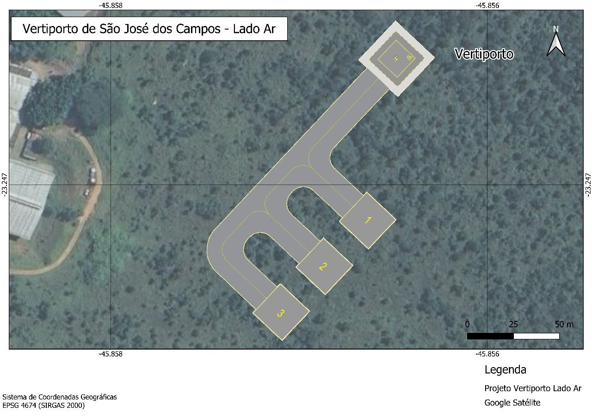

# **Projeto Conceitual de Vertiporto** 

Com o sítio definido no Aeroporto Internacional de São José dos Campos (SP), é iniciado o **projeto da parte ar do vertiporto**, utilizando as **legislações de referência**, um veículo **eVTOL de referência** e os cálculos necessários:

## Legislações de Referência ##

- [RBAC 155 (ANAC, 2024)](https://www.gov.br/anac/pt-br/assuntos/regulados/aeroportos-e-aerodromos/cadastro-de-aerodromos/procedimentos-para-aerodromos-privados/manual_orientacoes_infraestrutura_helipontos.pdf)
- [ICA 11-408 (DECEA, 2020)](https://publicacoes.decea.mil.br/publicacao/ica-11-408)

## Projeto do vertiporto ##

O dimensionamento foi baseado no **eVTOL Eve**, que possui dimensão **D = 15,2 m**, que corresponde ao **menor círculo que envolve a projeção da aeronave em planta horizontal**. A estrutura principal do vertiporto contempla:

- TLOF: Uma única área de pouso e decolagem, quadrada, com 15,2 m × 15,2 m, dimensionada com 1 × D, em conformidade com plataformas elevadas

- FATO: Área que envolve a TLOF, também quadrada, com 22,8 m × 22,8 m, equivalente a 1,5 × D

- Área de Segurança: Zona livre de obstáculos ao redor da FATO, com 30,4 m × 30,4 m (2 × D) 

- Orientação da FATO/TLOF/AS: Definida em 135°, conforme análise e necessidades do sítio

- Altitude e Localização: O vertiporto encontra-se a 630 m de altitude, com centro geográfico em -23.246330, 45.8564847

- Pista de taxiamento: Equivalente a D + 2 m, portanto, 17,2 m

O desenho esquemático da TLOF, FATO e Área de Segurança é mostrado a seguir.

**Figura 1 - Representação das dimensões da TLOF, FATO e Área de Segurança**  
  

*(Fonte: Autor)* 
 
Após definir a TLOF, FATO e Área de segurança, o esquema da parte ar completa é definido, considerando três stans para estacionamento, taxiamento e operação das aeronaves.

**Figura 2 - Planta detalhada do lado ar do vertiporto, com indicação das pistas de taxiamento e posições de stands**  
  

*(Fonte: Autor)* 

**Figura 3 - Planta esquemática do lado ar do vertiporto no local de implementação**  
  

*(Fonte: Autor)* 

**Figura 4 - Mapa geral da posição do vertiporto no terreno**  
  

*(Fonte: Autor)* 

Por fim, são projetadas as superfícies de aproximação com os seguintes critérios de dimensionamento:

- A largura da borda interna da rampa corresponde à largura da Área de Segurança (AS), ou seja, 30,4 m

- A largura final da rampa, após a abertura lateral, foi definida como 10 × D, resultando em 152 m

- A inclinação longitudinal da superfície de aproximação foi fixada em 12,5% (1:8)

- A abertura lateral foi determinada por uma tangente de 0,15, o que equivale a um ângulo de aproximadamente 8,53°

- O comprimento necessário até atingir a largura de 10D foi calculado como 405,33 m, com base na abertura lateral

- Após essa seção inicial, a rampa mantém uma porção paralela com 814,67 m de extensão

- O comprimento total da superfície de aproximação é de 1.220 m, conforme definido por norma

- Ao longo dessa extensão, a superfície alcança uma altura final de 152,5 m

- Foram previstas **duas rampas de aproximação**, orientadas nos rumos 135° e 315°, respectivamente

- O ponto de origem de cada rampa está localizado no **centro da borda frontal da AS**, deslocado 15,2 m a partir do centro do vertiporto, no rumo correspondente à rampa

As superfícies de aproximação são mostradas a seguir.

**Figura 5 - Desenho das rampas aplicadas no vertiporto**  
  

*(Fonte: Autor)* 

**Figura 6 - Desenho das rampas aplicadas no vertiporto**  
  

*(Fonte: Autor)* 

Para facilitar a visualização dos dados, todos os resultados são descritos na tabela a seguir:

**Resumo dos Parâmetros e Medidas do Heliponto**

| Elemento                                    | Cálculo               | Valor Final                    |
| ------------------------------------------- | --------------------- | ------------------------------ |
| **D (Diâmetro da aeronave de projeto)**     | —                     | **15,2 m**                     |
| **TLOF (Touchdown and Lift-Off Area)**      | Lado = D              | **15,2 m × 15,2 m**            |
| **FATO (Final Approach and Take-Off Area)** | Lado = 1,5 × D        | **22,8 m × 22,8 m**            |
| **Área de Segurança (AS)**                  | Lado = 2 × D          | **30,4 m × 30,4 m**            |
| **Rumo da FATO/TLOF/AS**                    | Definido pelo projeto | **135°**                       |
| **Altitude do terreno (nível do mar)**      | Informado             | **630 m**                      |
| **Centro geográfico do heliponto**          | Informado             | **(-23.246330, 45.8564847)** |

**Resumo das Superfícies de Aproximação**

| Parâmetro                         | Cálculo ou definição          | Valor Final                                    |
| --------------------------------- | ----------------------------- | ---------------------------------------------- |
| **Largura da borda interna**      | Igual à largura da AS         | **30,4 m**                                     |
| **Largura final (após abertura)** | 10 × D                        | **152 m**                                      |
| **Inclinação longitudinal**       | 1:8 (12,5%)                   | **12,5%**                                      |
| **Abertura lateral**              | Tangente = 0,15 (≈ 8,53°)     | 0,15 (15%)                                     |
| **Comprimento até atingir 10D**   | Δlargura ÷ (2 × tangente)     | **405,33 m**                                   |
| **Comprimento da seção paralela** | 1220 − 405,33                 | **814,67 m**                                   |
| **Comprimento total da rampa**    | Definido por norma            | **1220 m**                                     |
| **Altura final da rampa (z)**     | 1220 × 0,125                  | **152,5 m**                                    |
| **Superfícies geradas**           | Duas rampas: rumo 135° e 315° | ✅                                             |
| **Ponto de origem da rampa**      | Centro da borda frontal da AS | Afastado por 15,2 m do centro no rumo da rampa |
