# Atividade A1 - 18/03/2025

## 📊 Dados Demográficos e Socioeconômicos

Esta seção apresenta dados **sociodemográficos** e **econômicos** relevantes sobre o município de **São José dos Campos - SP**, obtidos a partir de fontes como:

📌 **Instituto Brasileiro de Geografia e Estatística (IBGE)**
🏛️ **Órgãos públicos (federais, estaduais e municipais)**
🌍 **Ferramentas governamentais e estudos privados**
🏙️ **Prefeitura de São José dos Campos**  

Esses dados fornecem um **panorama abrangente** das características **populacionais, sociais e econômicas** da região, permitindo uma melhor compreensão da **dinâmica e desenvolvimento** do município.  

---

### 🌆 Sobre São José dos Campos

São José dos Campos é uma **cidade estratégica**, localizada no **Vale do Paraíba**, interior do estado de São Paulo. Reconhecida por sua **forte indústria e tecnologia**, destaca-se como um dos principais **polos aeroespaciais e de inovação** do Brasil.  

🏭 **Destaques da cidade:**  
✅ Infraestrutura desenvolvida 🚧  
✅ Altos índices de qualidade de vida 🌱  
✅ Grandes empresas nacionais e multinacionais 🏢  
✅ Instituições de ensino e pesquisa de referência 🎓  

Além disso, sua localização **privilegiada** entre as capitais **São Paulo e Rio de Janeiro**, aliada a um **dinamismo econômico diversificado**, faz de São José dos Campos um **importante centro de desenvolvimento** no cenário nacional.  
### 🌍 Região Metropolitana do Vale do Paraíba e Litoral Norte (RMVale)  

- Criada em **2012**, a **RMVale** reúne municípios com **forte interdependência econômica e social**, promovendo uma gestão integrada para desafios regionais, como:  
  - **Mobilidade** 🚉  
  - **Infraestrutura** 🏗️  
  - **Meio ambiente** 🌱  

- Localização **estratégica** 📍:  
  - Situada entre as metrópoles de **São Paulo e Rio de Janeiro**, conecta **interior e litoral**.  
  - Atua como **eixo de desenvolvimento** do estado, impulsionando **indústria, comércio e turismo**.  
  - Rodovias **Presidente Dutra** e **Tamoios** facilitam o **escoamento da produção e circulação de pessoas**.  

- **São José dos Campos como cidade-polo** 🚀:  
  - Principal **motor econômico da RMVale**.  
  - Um dos **maiores PIBs do estado**.  
  - Forte presença de **indústrias de ponta** nos setores:  
    - **Aeroespacial** ✈️ (Embraer, Avibras)  
    - **Automotivo** 🚗 (General Motors)  
    - **Tecnológico** 💡  
  - Polo de **inovação e pesquisa**, com instituições de referência:  
    - **Instituto Tecnológico de Aeronáutica (ITA)** 🎓  
    - **Instituto Nacional de Pesquisas Espaciais (INPE)** 🛰️  
    - **Departamento de Ciência e Tecnologia Aeroespacial (DCTA)** 🏛️  
    - **Parque Tecnológico**, fomentando **startups e projetos científicos**.  

🖼 **Figura 1 - Região Metropolitana do Vale do Paraíba e do Litoral Norte**  
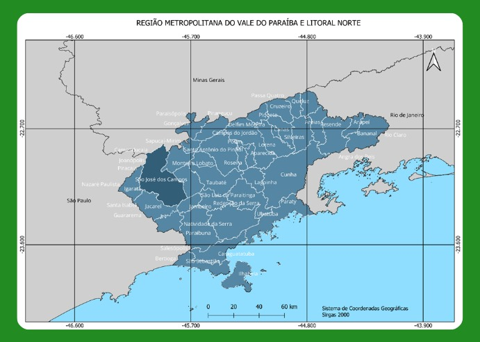  

*(Fonte: Autor.)*  

---

### 🗺️ Divisão Geográfica  

A cidade pode ser dividida em **sete regiões geográficas principais**, ou **macrozonas**:  

📍 **Centro**  
📍 **Norte**  
📍 **Sul**  
📍 **Sudeste**  
📍 **Leste**  
📍 **Oeste**  
📍 **Extremo Norte**  

🔹 **Regiões mais populosas**: **Leste e Sul**  
🔹 **Regiões com maior densidade populacional**: **Centro e Sul**  

🖼 **Figura 2 - Número de habitantes e densidade populacional**  
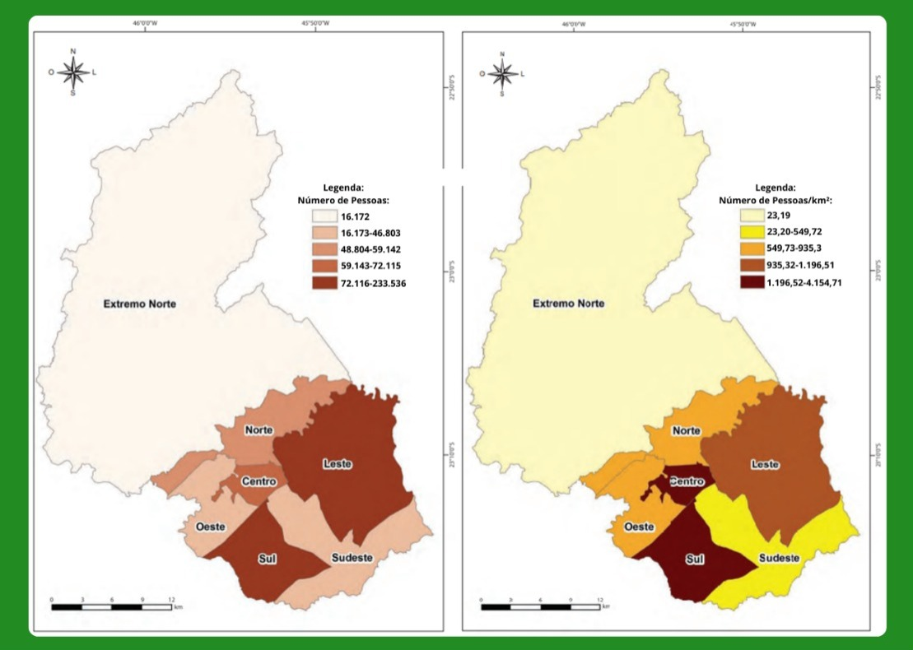  

*(Fonte: Adaptado de FGV Atlas OD - https://www.sjc.sp.gov.br/media/56152/atlas_origem_destino_baixa_res.pdf.)*  

---

### 📈 Dados Populacionais e Econômicos  

📊 **População e Densidade Demográfica**  
- De acordo com os dados do último **Censo IBGE (2022)**, a cidade possui **697.054 habitantes**.  
- Para **2024**, a população estimada é de **724.756 habitantes**.  
- A **densidade demográfica** é de **634,03 habitantes por km²**.  

💰 **Indicadores Econômicos**  
- **Índice de Desenvolvimento Humano Municipal (IDH-M)**: **0,807** (um dos maiores do Brasil).  
- **PIB per capita**: **+61 mil reais**.  
- **Salário médio mensal**: **3,3 salários mínimos**.  
- **Emprego formal**: **Aproximadamente 36% da população empregada formalmente**.  

📏 **Área Territorial**  
- **Área total do município**: **1.099,409 km²**.  
- **Área urbanizada**: **128,94 km²**.  

🖼 **Figura 3 - Dados sobre população, trabalho, economia, meio ambiente e território**  
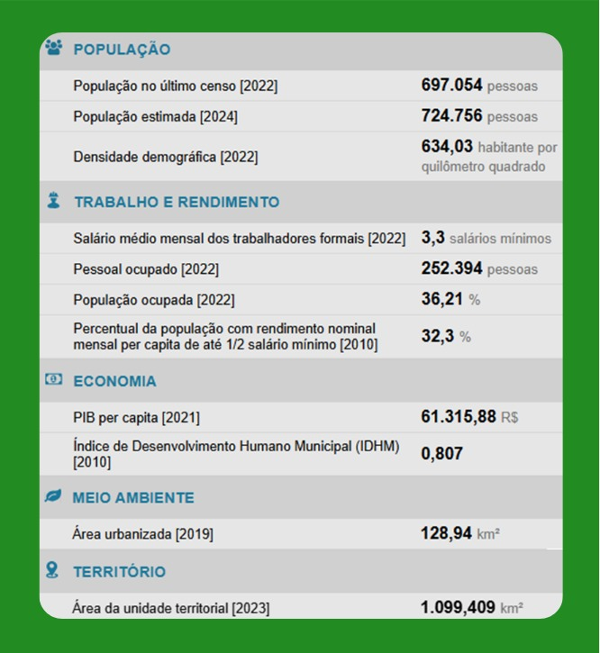  

*(Fonte: Adaptado de IBGE -https://cidades.ibge.gov.br/brasil/sp/sao-jose-dos-campos/panorama)*  

---

### 🚦 Densidade Populacional por Zona de Tráfego  

Além da divisão geográfica principal, São José dos Campos também pode ser analisada a partir das **zonas de tráfego**, dentro das áreas mais urbanizadas da cidade. A **Figura 3** apresenta o **número de habitantes e a densidade populacional** em cada uma dessas zonas.  

🖼 **Figura 4 - Número de habitantes e densidade populacional por zona de tráfego**  
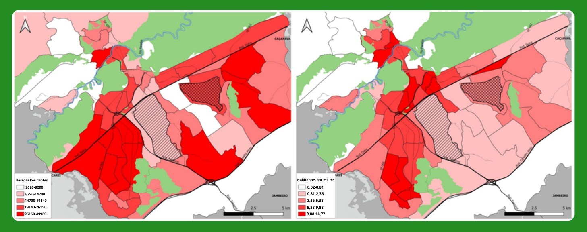  

*(Fonte: Adaptado de FGV Consolidação - https://www.sjc.sp.gov.br/media/148074/consolidacao-dos-dados.pdf)*  

---

### 💵 Renda Per Capita por Setor Censitário  

Para entender melhor a **distribuição da renda** na cidade, a **Figura 4** apresenta a **renda per capita por setor censitário** dentro das áreas mais urbanizadas de São José dos Campos, enquanto a **Figura 5** apresenta a **renda per capita mensal média** em cada macrozona.  

🖼 **Figura 5 - Renda per capita por setor censitário**  
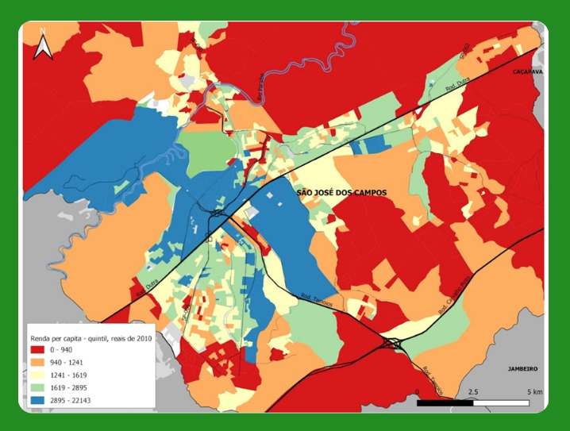  

*(Fonte: Adaptado de FGV Consolidação - https://www.sjc.sp.gov.br/media/148074/consolidacao-dos-dados.pdf)*  

🖼 **Figura 6 - Renda per capita mensal média**  
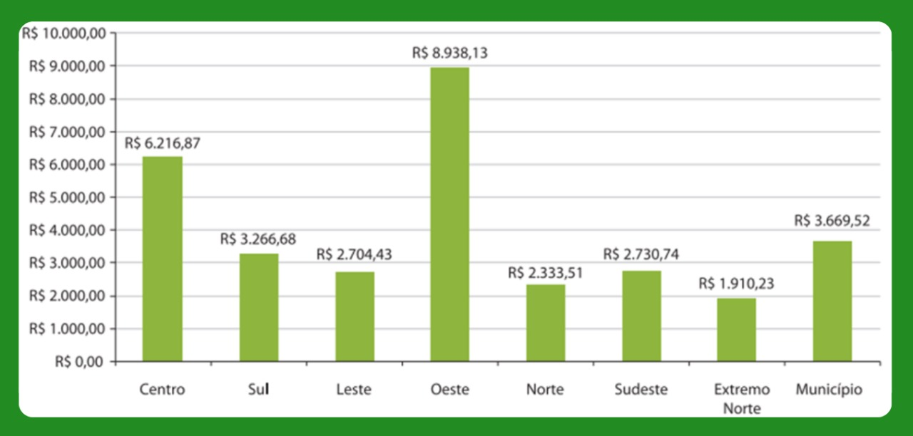  

*(Fonte: Adaptado de IBGE - https://cidades.ibge.gov.br/brasil/sp/sao-jose-dos-campos/panorama)*  

---

### 🌍 Panorama Geral dos Dados  

Na **Figura 7**, é apresentado um **panorama geral** sobre os **dados demográficos e socioeconômicos** de São José dos Campos.  

🖼 **Figura 7 - Panorama Geral dos Dados Demográficos e Socioeconômicos**  
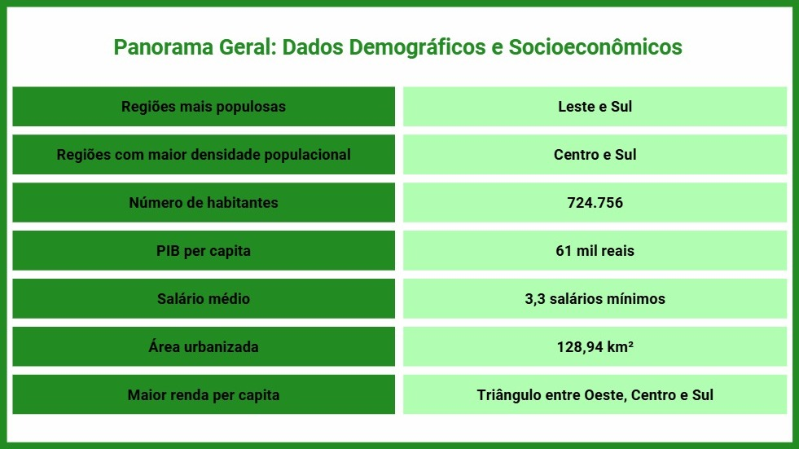  

*(Fonte: Autor.)*  

---

## 🚏 Infraestrutura Viária e Transporte  

A mobilidade urbana em **São José dos Campos** é estruturada por uma ampla rede de transporte público, pontos de táxi, semáforos e conexões viárias com outros municípios. Esses elementos desempenham um papel essencial na organização do tráfego e na acessibilidade da cidade.  

---

### 🚍 Distribuição dos Pontos de Ônibus  

Os **pontos de ônibus** estão **bem distribuídos** ao longo da região mais urbanizada da cidade, garantindo cobertura eficiente para o transporte coletivo. Além disso, há pontos estrategicamente localizados em regiões menos populosas, permitindo o deslocamento de moradores dessas áreas para os principais centros urbanos.  

🖼 **Figura 7 - Distribuição de pontos de ônibus**  
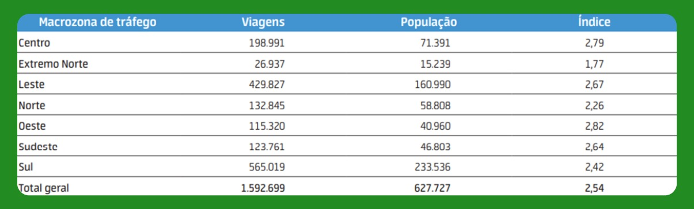  

*(Fonte: Adaptado de https://sjview.sjc.sp.gov.br.)*  

---

### 🚖 Localização dos Pontos de Táxi  

Os **pontos de táxi** concentram-se principalmente nas regiões **Centro e Sul** da cidade, onde há maior demanda por transporte individual. Essa distribuição reflete a alta movimentação nessas áreas, que abrigam importantes centros comerciais, empresariais e serviços públicos.  

🖼 **Figura 8 - Distribuição dos pontos de táxi**  
  

*(Fonte: Adaptado de https://sjview.sjc.sp.gov.br.)*  

---

### 🚦 Distribuição dos Semáforos  

Os **semáforos** estão **predominantemente localizados ao longo das áreas adjacentes à Rodovia Dutra**, uma das principais vias de acesso à cidade. A maior concentração de semáforos ocorre nas regiões **Centro, Sul e Oeste**, onde há maior fluxo de veículos e necessidade de controle do trânsito. No entanto, eles também se fazem presentes nas demais regiões da cidade, embora em menor quantidade.  

🖼 **Figura 9 - Distribuição dos semáforos**  
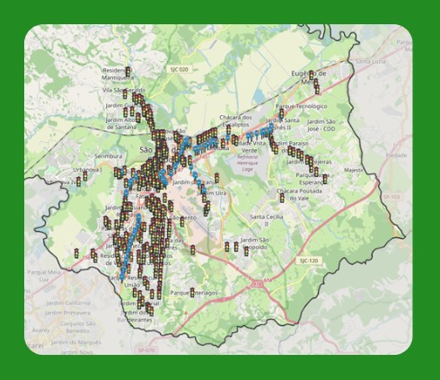  

*(Fonte: Adaptado de https://sjview.sjc.sp.gov.br.)*  

---

### 🛣️ Ligações Viárias com Outros Municípios  

A cidade conta com **importantes conexões rodoviárias** que a ligam a municípios vizinhos e às principais capitais do Brasil. A **Rodovia Presidente Dutra (BR-116)** é a principal via de acesso, conectando **São José dos Campos** a **São Paulo e Rio de Janeiro**. Além disso, a cidade possui acessos estratégicos às rodovias **Tamoios (SP-099)**, que leva ao litoral norte, e **Carvalho Pinto (SP-070)**, que serve como uma alternativa rápida para a capital paulista.  

🖼 **Figura 10 - Ligações viárias com outros municípios**  
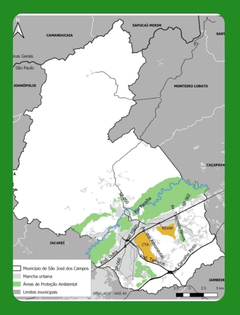  

*(Fonte: Adaptado de FGV Atlas OD - https://www.sjc.sp.gov.br/media/56152/atlas_origem_destino_baixa_res.pdf.)*  

---

### 🏙️ Hierarquia Viária  

A **hierarquia viária** de São José dos Campos é organizada em diferentes tipos de vias, conforme sua importância e função no fluxo urbano:  

- **Rodovia**: vias que ligam São José dos Campos com outros municípios.
- **Vias arteriais**: principais corredores de tráfego, interligando as diferentes regiões da cidade.  
- **Vias coletoras**: conectam as vias arteriais a bairros e zonas residenciais.  
- **Vias locais**: permitem o acesso direto a residências, estabelecimentos comerciais e pequenas ruas internas dos bairros.  

Essa organização facilita a mobilidade dentro do município e melhora a eficiência no tráfego, garantindo acesso rápido a diferentes regiões.  

🖼 **Figura 11 - Hierarquia viária de São José dos Campos**  
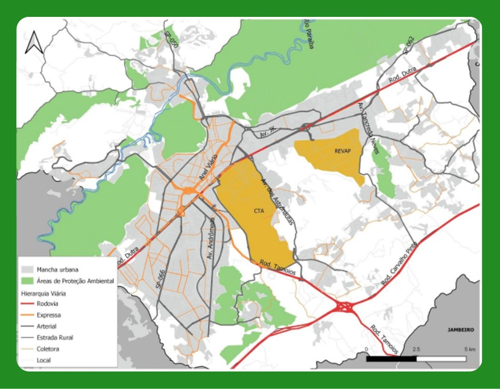  

*(Fonte: Adaptado de FGV Atlas OD - https://www.sjc.sp.gov.br/media/56152/atlas_origem_destino_baixa_res.pdf.)*  

---

## 🚦 Fluxo e Demanda de Transporte  

O fluxo de transporte em **São José dos Campos** é fortemente influenciado pelas características urbanas e econômicas da cidade. A distribuição da demanda por viagens reflete a organização das atividades econômicas, a localização de polos de emprego, comércio e serviços, além das condições da infraestrutura viária.  

A seguir, são apresentadas análises sobre as **vias com maior densidade de transporte coletivo** e as **viagens entre as macrozonas**, que ajudam a compreender melhor os padrões de deslocamento na cidade.  

---

### 🚌 Vias com Maior Densidade de Transporte Coletivo  

Determinadas vias concentram um **alto fluxo de transporte coletivo**, representando os principais corredores utilizados pelos ônibus urbanos. Essas vias desempenham um papel essencial na mobilidade da população, conectando bairros residenciais a áreas comerciais e polos de emprego.  

🖼 **Figura 12 - Vias com maior densidade de transporte coletivo**  
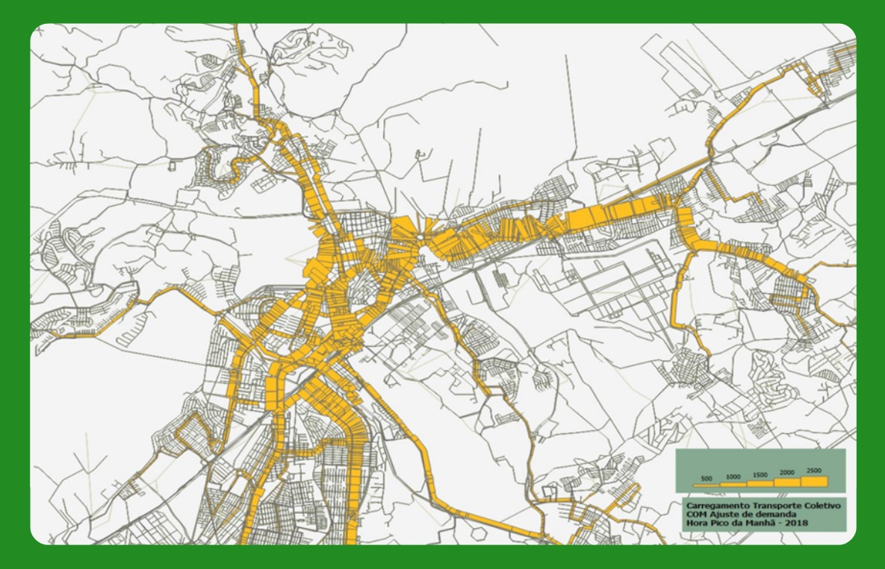  

*(Fonte: Adaptado de FGV Atlas OD - https://www.sjc.sp.gov.br/media/56152/atlas_origem_destino_baixa_res.pdf.)*  

---

### 🔄 Viagens entre as Macrozonas  

A dinâmica do transporte urbano também pode ser analisada a partir das **viagens entre as macrozonas da cidade**. Esse estudo permite identificar os fluxos predominantes e os principais eixos de deslocamento da população, auxiliando no planejamento de melhorias para o sistema viário e transporte público.  

📌 **Principais Regiões de Origem das Viagens:**  
1️⃣ **Sul**  
2️⃣ **Centro**  
3️⃣ **Leste**  

📌 **Principais Regiões de Destino das Viagens:**  
1️⃣ **Sul**  
2️⃣ **Leste**  
3️⃣ **Centro**  

🖼 **Figura 13 - Viagens entre as macrozonas**  
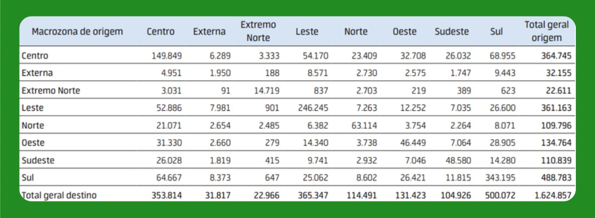  

*(Fonte: Adaptado de FGV Atlas OD - https://www.sjc.sp.gov.br/media/56152/atlas_origem_destino_baixa_res.pdf.)*  

---

## 🚗 Frota de Veículos  

A frota de veículos em **São José dos Campos** reflete a mobilidade urbana e a dependência do transporte individual e coletivo na cidade. A análise dos veículos disponíveis por mil habitantes permite uma compreensão mais precisa da dinâmica de deslocamento da população e do impacto no tráfego urbano.  

A seguir, são apresentados gráficos sobre a **frota total de veículos**, a **frota de veículos individuais** e a **frota de veículos coletivos** por mil habitantes.  

---

### 📊 Frota de Veículos por Mil Habitantes  

O gráfico abaixo apresenta a **quantidade total de veículos por mil habitantes**, permitindo avaliar o nível de motorização da população e suas possíveis implicações para a infraestrutura viária e mobilidade urbana.  

🖼 **Figura 14 - Frota de veículos por mil habitantes**  
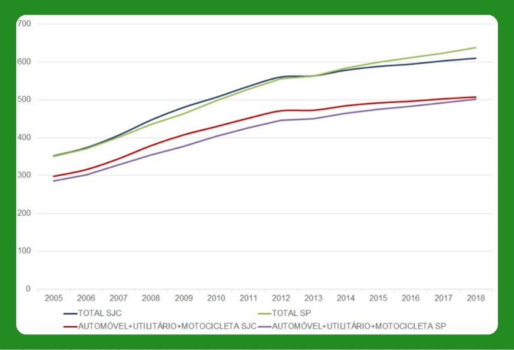  

*(Fonte: Adaptado de FGV Atlas OD - https://www.sjc.sp.gov.br/media/56152/atlas_origem_destino_baixa_res.pdf.)*  

📌 **Observação:**  
🚗 **São José dos Campos** possui mais de **600 veículos para cada mil habitantes**, quase ultrapassando a cidade de **São Paulo**, que tem um dos maiores índices de motorização do país.  

---

### 🚘 Frota de Veículos Individuais por Mil Habitantes  

A quantidade de **veículos individuais** (como carros e motocicletas) por mil habitantes é um indicador importante da **dependência do transporte privado**. O gráfico a seguir ilustra a distribuição dessa frota na cidade.  

🖼 **Figura 15 - Frota de veículos individuais por mil habitantes**  
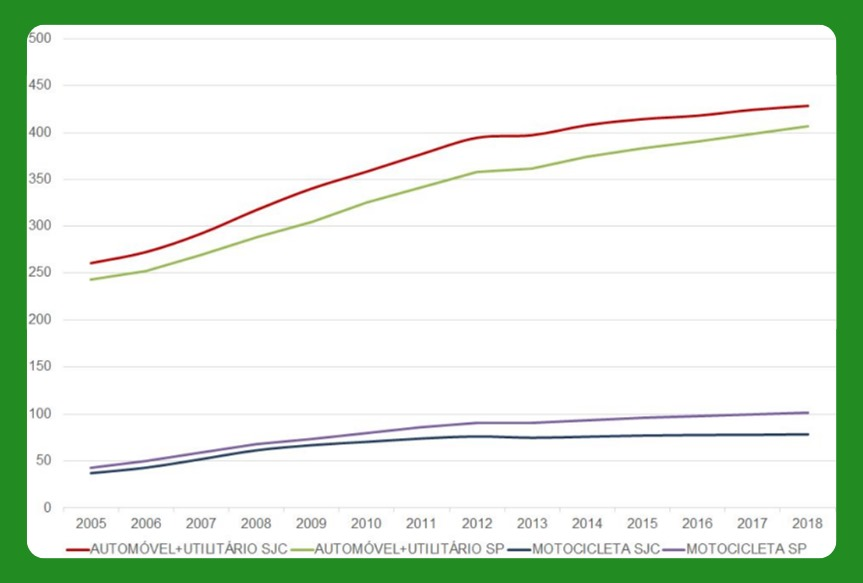  

*(Fonte: Adaptado de FGV Atlas OD - https://www.sjc.sp.gov.br/media/56152/atlas_origem_destino_baixa_res.pdf.)*  

📌 **Observação:**  
🚘 Considerando apenas **veículos individuais**, **São José dos Campos** possui quase **500 veículos para cada mil habitantes**, um número **superior ao da cidade de São Paulo**.  

---

### 🚌 Frota de Veículos Coletivos por Mil Habitantes  

Os veículos de transporte coletivo, como ônibus e vans, desempenham um papel fundamental na mobilidade urbana. O gráfico abaixo apresenta a **quantidade de veículos coletivos disponíveis por mil habitantes**, permitindo avaliar a capacidade do sistema de transporte público em relação à demanda populacional.  

🖼 **Figura 16 - Frota de veículos coletivos por mil habitantes**  
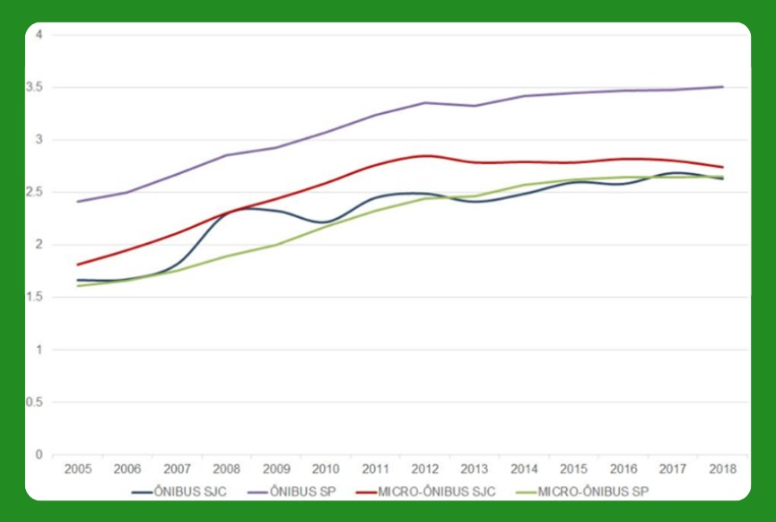  

*(Fonte: Adaptado de FGV Atlas OD - https://www.sjc.sp.gov.br/media/56152/atlas_origem_destino_baixa_res.pdf.)*  

📌 **Observação:**  
🚌 Em relação aos **veículos coletivos**, **São José dos Campos** possui **quase metade da frota per capita de São Paulo**. Isso indica que há **espaço para o desenvolvimento do transporte intraurbano coletivo**, reforçando a necessidade de investimentos no setor.  

---

## 🚦 Distribuição e Uso dos Meios de Transporte  

A distribuição modal dos meios de transporte em **São José dos Campos** reflete os padrões de deslocamento da população e a acessibilidade das opções de mobilidade na cidade. A análise considera a **proporção de cada meio de transporte**, a **comparação modal com outras cidades** e a **média do uso de cada tipo de transporte considerando a renda média**.  

A seguir, são apresentados gráficos para ilustrar esses aspectos.  

---

### 📊 Distribuição Percentual dos Meios de Transporte  

O gráfico a seguir apresenta a **porcentagem de cada meio de transporte utilizado** pelos moradores de São José dos Campos. Essa distribuição evidencia a predominância de determinados modos de deslocamento, como transporte individual, coletivo e não motorizado. A maior parte dos veículos utilizados na cidade são **automóveis**, enquanto a segunda maior parcela representa **veículos de transporte de passageiros**, evidenciando a dependência do transporte privado e coletivo na mobilidade urbana.  

🖼 **Figura 17 - Porcentagem de meios de transporte e seus usos**  
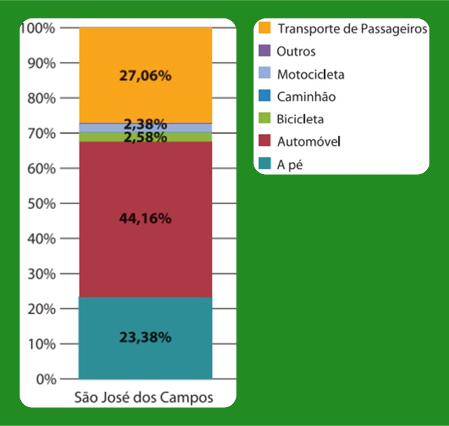  

*(Fonte: Adaptado de FGV Atlas OD - https://www.sjc.sp.gov.br/media/56152/atlas_origem_destino_baixa_res.pdf.)*  

---

### 🚍 Categorias de Transporte e Comparação Modal  

Os meios de transporte podem ser classificados em diferentes categorias, como **transporte individual, coletivo e ativo (não motorizado)**. Além disso, a distribuição modal de São José dos Campos pode ser comparada com cidades de tamanho semelhante, permitindo avaliar se os padrões de deslocamento são similares ou apresentam diferenças significativas.  

Ao analisar essa comparação, percebe-se que **São José dos Campos possui uma taxa muito maior de transporte individual** do que cidades com populações diversas, enquanto **o transporte coletivo é significativamente menor**. Já o uso de meios de transporte ativo, como caminhada e bicicleta, se mantém **em patamares semelhantes aos de outras cidades**, indicando que a infraestrutura para mobilidade ativa tem um impacto equilibrado independentemente do porte da cidade.  

🖼 **Figura 18 - Categorias de transportes e comparação com outras cidades**  
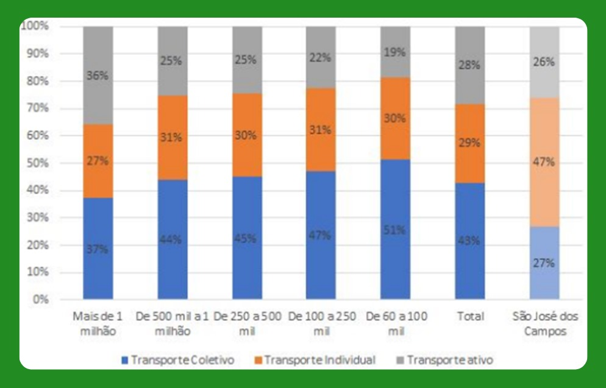  

*(Fonte: Adaptado de FGV Atlas OD - https://www.sjc.sp.gov.br/media/56152/atlas_origem_destino_baixa_res.pdf.)*  

---

### 🚶‍♂️ Média do Uso de Cada Modo de Transporte Considerando a Renda Média  

Além da distribuição percentual e da comparação modal, é importante observar a **média do uso de cada modo de transporte em relação à renda média da população**. O gráfico abaixo mostra a relação direta entre **níveis de renda e escolha do meio de transporte**.  

Os dados indicam que **quanto maior a renda mensal, maior a preferência pelo automóvel particular** como meio de deslocamento principal. Esse padrão reflete uma **tendência natural** observada em diversas cidades, onde o aumento do poder aquisitivo resulta na priorização do transporte individual em detrimento do transporte coletivo.  

🖼 **Figura 19 - Média do modo de transporte considerando a renda média**  
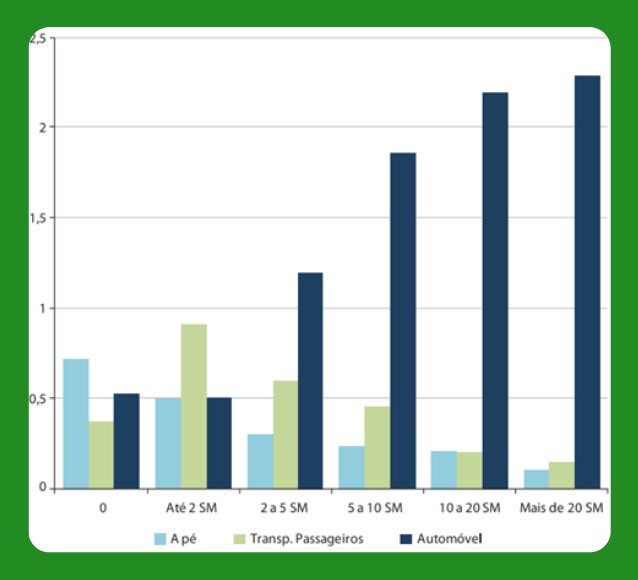  

*(Fonte: Adaptado de FGV Atlas OD - https://www.sjc.sp.gov.br/media/56152/atlas_origem_destino_baixa_res.pdf.)*  

---

## 🚦 Índice de Mobilidade  

O **Índice de Mobilidade** mede a capacidade de deslocamento da população dentro da cidade, considerando fatores como infraestrutura de transporte, distância percorrida e acessibilidade a diferentes regiões. Em **São José dos Campos**, um município com forte presença industrial e tecnológica, esse índice reflete tanto os deslocamentos diários para o trabalho quanto a eficiência da mobilidade urbana.  

A seguir, são apresentados gráficos que mostram o **índice de mobilidade por região** e o **índice de mobilidade em relação à renda da população**.  

---

### 🏙️ Índice de Mobilidade por Região  

A distribuição espacial do **índice de mobilidade** revela que as regiões com **maior índice** são, na seguinte ordem: **Oeste, Centro e Leste**. Essas áreas correspondem justamente aos pontos de **maior concentração industrial**, o que sugere que os índices de mobilidade refletem não apenas o acesso ao transporte, mas também os deslocamentos entre **zonas domiciliares e polos industriais**. Isso reforça a característica de **São José dos Campos como um grande polo industrial e tecnológico**, onde a mobilidade urbana está fortemente vinculada às atividades produtivas.  

🖼 **Figura 20 - Índice de mobilidade por região**  
  

*(Fonte: Adaptado de FGV Atlas OD - https://www.sjc.sp.gov.br/media/56152/atlas_origem_destino_baixa_res.pdf.)*  

---

### 💰 Índice de Mobilidade por Faixa de Renda  

Além da variação espacial, o índice de mobilidade também apresenta diferenças significativas quando analisado em relação à renda. O gráfico abaixo mostra uma **tendência previsível**: **quanto maior a renda, maior o índice de mobilidade**. Esse padrão indica que pessoas com maior poder aquisitivo têm **mais opções de transporte**, podendo optar por veículos particulares ou rotas mais eficientes no transporte coletivo.  

🖼 **Figura 21 - Índice de mobilidade por salário mínimo**  
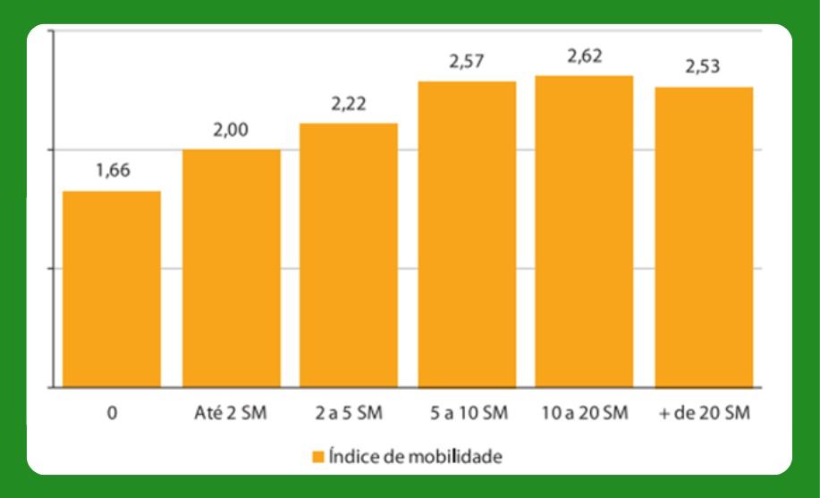  

*(Fonte: Adaptado de FGV Atlas OD - https://www.sjc.sp.gov.br/media/56152/atlas_origem_destino_baixa_res.pdf.)*  

---

## 🚁 Regulação para Vertiportos  

### 📜 Normas Correlatas  

#### ✈️ ICAO - Organização da Aviação Civil Internacional  

- **Anexo 14**: Este anexo da ICAO fornece padrões e práticas recomendadas para aeródromos, incluindo helipontos. Ele cobre aspectos como projeto, construção, operação e manutenção de helipontos.  
- **Doc 9261 (Manual de Heliportos)**: Documento da ICAO com orientações detalhadas sobre o projeto, construção e operação de helipontos, incluindo considerações sobre segurança, sinalização e iluminação.  

*(Fonte: ICAO - Organização da Aviação Civil Internacional - https://www.icao.int/Pages/default.aspx.)*  

---

#### 🇧🇷 Brasil  

##### 📖 **Lei Federal**  
- **Lei nº 7.565, de 19 de dezembro de 1986**: Código Brasileiro de Aeronáutica.  

*(Fonte: Presidência da República - Legislação Federal - https://www.planalto.gov.br/ccivil_03/leis/l7565compilado.htm#:~:text=LEI%20N%C2%BA%207.565%2C%20DE%2019%20DE%20DEZEMBRO%20DE%201986.&text=Disp%C3%B5e%20sobre%20o%20C%C3%B3digo%20Brasileiro%20de%20Aeron%C3%A1utica.&text=Art.,C%C3%B3digo%20e%20pela%20legisla%C3%A7%C3%A3o%20complementar..)*  

##### 🏛 **ANAC - Agência Nacional de Aviação Civil**  
- **RBAC 155 (Regulamento Brasileiro da Aviação Civil nº 155)**: Estabelece os requisitos para a construção, operação e manutenção de helipontos, cobrindo aspectos como localização, dimensionamento, sinalização, iluminação e segurança.  
- **Manual de Orientações de Infraestrutura de Helipontos**: Documento de referência para projetos de helipontos, auxiliando no entendimento dos elementos previstos no RBAC nº 155.  
- **RBAC-E nº 94/2017**: Este Regulamento Brasileiro da Aviação Civil Especial – RBAC-E aborda os requisitos gerais de competência da ANAC para aeronaves não tripuladas.  

*(Fonte: ANAC - Agência Nacional de Aviação Civil - https://www.anac.gov.br/assuntos/legislacao/legislacao-1/rbha-e-rbac/rbac/rbac-155 - https://www.gov.br/anac/pt-br/assuntos/regulados/aeroportos-e-aerodromos/cadastro-de-aerodromos/procedimentos-para-aerodromos-privados/manual_orientacoes_infraestrutura_helipontos.pdf - https://www.anac.gov.br/assuntos/legislacao/legislacao-1/rbha-e-rbac/rbac/rbac-e-94)*  

##### ✈️ **DECEA - Departamento de Controle do Espaço Aéreo**  
- **ICA 11-408 (Instrução do Comando da Aeronáutica nº 11-408)**: Restrições aos objetos projetados no espaço aéreo que possam afetar adversamente a segurança ou a regularidade das operações aéreas.  

*(Fonte: DECEA - Departamento de Controle do Espaço Aéreo - https://sysaga.decea.mil.br/download/32.)*  

---

#### 🏙️ Prefeitura de São José dos Campos  

- **Decreto nº 19.665, de 14 de junho de 2024**: Regulamenta a Lei Complementar nº 633, de 3 de abril de 2020, que "dispõe sobre exigências e normas relativas ao licenciamento, aprovação e instalação de empreendimentos classificados ou não como Polo Gerador de Tráfego - PGT", e disciplina as vagas de estacionamento, os acessos, vias de circulação interna, a área de manobra e a acumulação de veículos e dá outras providências.  
- **Lei Complementar nº 623, de 9 de outubro de 2019**: Estabelece as normas relativas ao parcelamento, uso e ocupação do solo, em consonância com o Plano Diretor de Desenvolvimento Integrado do Município de São José dos Campos aprovado e instituído pela Lei Complementar nº 612, de 30 de novembro de 2018. *(Aeródromo sujeito a análise específica.)* 
- **Plano Municipal de Mobilidade Urbana – Lei Complementar nº 576/2016**: Institui a política municipal de mobilidade urbana no município de São José dos Campos e dá outras providências.  
- **Lei de Uso e Ocupação do Solo – Lei Complementar nº 623/2019**: Estabelece as normas relativas ao parcelamento, uso e ocupação do solo, em consonância com o Plano Diretor de Desenvolvimento Integrado do Município de São José dos Campos aprovado e instituído pela Lei Complementar nº 612/2018.  

*(Fonte: Prefeitura de São José dos Campos - https://www.sjc.sp.gov.br/media/289924/decreto-pgt_19665-2024.pdf - https://www.sjc.sp.gov.br/media/198888/lc-623_19-alterada-pela-lc632_20_atualizjun2022.pdf - https://www.sjc.sp.gov.br/media/148068/lc_576_2016-plano_de_mobilidade_urbana-planmob.pdf - https://www.sjc.sp.gov.br/media/198888/lc-623_19-alterada-pela-lc632_20_atualizjun2022.pdf)*  

---

## 🌍 Zoneamento Urbano e Uso de Solo  

A cidade de **São José dos Campos** possui diferentes zonas que regulam o uso e a ocupação do solo, garantindo um crescimento ordenado e equilibrado. Essas zonas são organizadas de acordo com sua função principal, permitindo desde áreas estritamente residenciais até espaços destinados a comércios, indústrias e preservação ambiental.  

🖼 **Figura 23 - Mapa de uso e ocupação do solo SJCampos**  
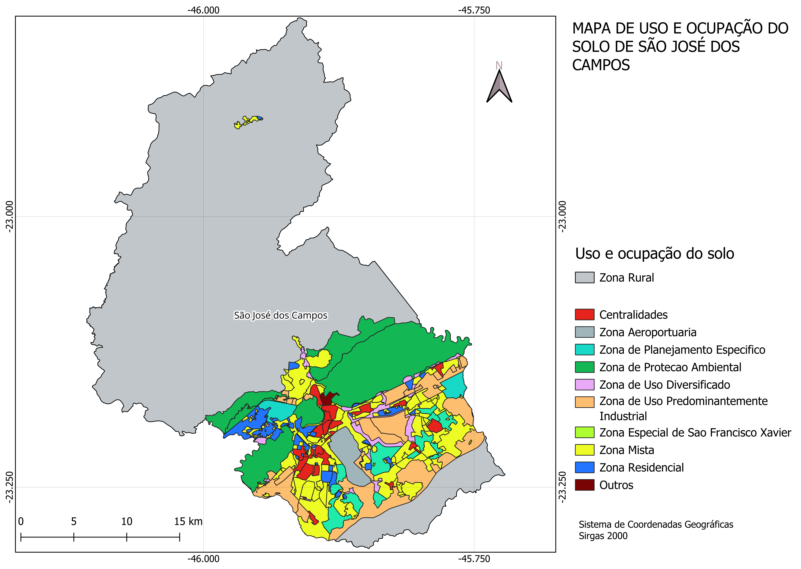  
*(Fonte: Autor.)*  

### 1. Centralidade  
Incluem as **Centralidades Locais e Metropolitanas**, que concentram comércios, serviços e habitação verticalizada. Nessas áreas, há grande movimentação urbana e facilidade de acesso. Variam conforme a abrangência, desde pequenos comércios para atender bairros até polos comerciais de impacto regional e metropolitano.  

### 2. Corredores  
Eixos viários que permitem comércio e serviços de diferentes portes. São usados como áreas de transição entre zonas residenciais e comerciais mais intensas. Variam de pequenos comércios locais a grandes empreendimentos de alto fluxo, estruturando o crescimento da cidade ao longo das principais vias.  

### 3. Zonas Residenciais  
Destinadas principalmente à moradia, diferem pela densidade permitida:  
- **ZR1**: Áreas de **baixa densidade**, com casas isoladas.  
- **ZR2**: Áreas de **média densidade**, com sobrados e pequenos edifícios.  
- **ZR3**: Áreas de **alta densidade**, permitindo edifícios maiores.  

Nessas zonas, a presença de comércios e serviços é restrita para preservar o caráter habitacional.  

### 4. Zonas de Uso Diversificado  
Permitem a coexistência de moradia, comércio e serviços no mesmo espaço. Promovem o **uso misto do solo**, garantindo um equilíbrio entre atividades urbanas e residenciais. Variam conforme a intensidade das atividades comerciais permitidas, desde pequenos negócios locais até estabelecimentos de maior porte.  

### 5. Zonas Industriais  
Destinadas a atividades industriais e logísticas, classificadas de acordo com o impacto ambiental e a necessidade de afastamento das áreas residenciais:  
- **ZI1**: **Indústrias leves**, compatíveis com a cidade.  
- **ZI2**: **Indústrias de médio porte**, exigindo infraestrutura específica.  
- **ZI3**: **Indústrias de alto impacto**, exigindo afastamento maior das áreas urbanas.  

### 6. Zonas Especiais  
Áreas designadas para usos específicos, visando atender a demandas sociais, ambientais e urbanísticas:  
- **ZEIS**: Zonas destinadas à **habitação de interesse social**.  
- **ZEPA**: **Áreas protegidas** para **conservação ambiental**.  
- **ZPE1** e **ZPE2**: Áreas que exigem planejamento específico, seja para regularização de glebas urbanas (**ZPE1**) ou para ocupação ordenada de locais estratégicos (**ZPE2**).  

### 7. Zona Aeroportuária  
Área exclusiva para **operações aeroportuárias** e **logística aérea**. Permite atividades relacionadas à aviação, como hangares, terminais e serviços de suporte.  

### 8. Zonas de São Francisco Xavier  
Regiões específicas para preservar o caráter natural e cultural do distrito:  
- **ZESFX**: Núcleo urbano com **incentivos ao turismo** e **preservação cultural**.  
- **APA São Francisco Xavier**: **Área de proteção ambiental**, garantindo o uso sustentável do território e restringindo ocupações que possam degradar o meio ambiente.  

---

