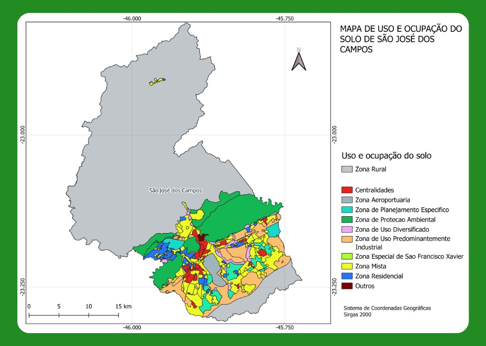

# **São José dos Campos - SP** 

São José dos Campos é uma **cidade estratégica** localizada no **Vale do Paraíba**, interior do estado de São Paulo. Reconhecida por sua **forte indústria e tecnologia**, destaca-se como um dos principais **polos aeroespaciais e de inovação** do Brasil. Além disso, sua localização **privilegiada** entre as capitais **São Paulo e Rio de Janeiro**, aliada a um **dinamismo econômico diversificado**, faz de São José dos Campos um **importante centro de desenvolvimento** no cenário nacional.

**Figura 1 - São José dos Campos - Região Metropolitana do Vale do Paraíba e do Litoral Norte**  
  

*(Fonte: Adaptado de [IBGE](https://www.ibge.gov.br/geociencias/organizacao-do-territorio/estrutura-territorial/18354-recortes-metropolitanos-e-aglomeracoes-urbanas.html))* 

---

## Destaques da Cidade 
 
- **Infraestrutura desenvolvida** 
- **Alto índice de qualidade de vida** 
- **Forte indústria e tecnologia**
- **Polo aeroespacial e tecnológico** 
- **Instituições de ensino e pesquisa de referência**  

---

## Divisão Geográfica  

A cidade pode ser dividida em **sete regiões geográficas principais**, ou **macrozonas**:  

- Centro  
- Norte 
- Sul  
- Sudeste 
- Leste  
- Oeste  
- Extremo Norte

**Regiões mais populosas**: Leste e Sul  
**Regiões com maior densidade populacional**: Centro e Sul 

**Figura 2 - Número de habitantes e densidade populacional**  
  

*(Fonte: Adaptado de [FGV Atlas OD](https://www.sjc.sp.gov.br/media/56152/atlas_origem_destino_baixa_res.pdf))*  

---

## Dados Populacionais e Econômicos  
  
- **População Censo IBGE 2022**: 697.054 habitantes  
- **População estimada em 2024**: 724.756 habitantes  
- **Densidade demográfica**: 634,03 hab/km²   
- **Índice de Desenvolvimento Humano Municipal (IDHM)**: 0,807  
- **PIB per capita**: +61 mil reais  
- **Salário médio mensal**: 3,3 salários mínimos    
- **Área total do município**: 1.099,409 km²  
- **Área urbanizada**: 128,94 km²

**Figura 3 - Dados sobre população, trabalho, economia, meio ambiente e território**  
  

*(Fonte: Adaptado de [IBGE](https://cidades.ibge.gov.br/brasil/sp/sao-jose-dos-campos/panorama))*

---

## Renda Per Capita Mensal por Macrozona

- **Regiões com maior renda per capita mensal**: Oeste, Centro e Sul

**Figura 4 - Renda per capita mensal média**  
  

*(Fonte: Adaptado de [IBGE](https://cidades.ibge.gov.br/brasil/sp/sao-jose-dos-campos/panorama))*  

---

## Panorama Geral dos Dados  

**Figura 5 - Panorama Geral dos Dados Demográficos e Socioeconômicos**  
  

*(Fonte: Autor)*  

---

## Transporte e Fluxo 
 
**Figura 6 - Hierarquia viária de São José dos Campos**  
  

*(Fonte: Adaptado de [FGV Atlas OD](https://www.sjc.sp.gov.br/media/56152/atlas_origem_destino_baixa_res.pdf))*   

**Principais Regiões de Origem das Viagens:** 
 
- Sul
- Centro
- Leste

**Principais Regiões de Destino das Viagens:**
  
- Sul
- Leste
- Centro

**Figura 7 - Viagens entre as macrozonas**  
  

*(Fonte: Adaptado de [FGV Atlas OD](https://www.sjc.sp.gov.br/media/56152/atlas_origem_destino_baixa_res.pdf))*   

**Regiões com Maior Mobilidade:** 
 
- Oeste
- Centro
- Leste

**Figura 8 - Índice de mobilidade por região**  
  

*(Fonte: Adaptado de [FGV Atlas OD](https://www.sjc.sp.gov.br/media/56152/atlas_origem_destino_baixa_res.pdf))* 

**Principais Meios de Transporte:** 
 
- Automóvel (individual)
- Transporte de passageiros (coletivo e individual)

**Figura 9 - Porcentagem de meios de transporte e seus usos**  
  

*(Fonte: Adaptado de [FGV Atlas OD](https://www.sjc.sp.gov.br/media/56152/atlas_origem_destino_baixa_res.pdf))*   

---

## Regulamentos e Normas

**[ICAO - Organização da Aviação Civil Internacional](https://www.icao.int/Pages/default.aspx)**:  

- **Anexo 14**: Este anexo da ICAO fornece padrões e práticas recomendadas para aeródromos, incluindo helipontos. Ele cobre aspectos como projeto, construção, operação e manutenção de helipontos  
- **Doc 9261 (Manual de Heliportos)**: Documento da ICAO com orientações detalhadas sobre o projeto, construção e operação de helipontos, incluindo considerações sobre segurança, sinalização e iluminação 

**[Lei Federal](https://www.planalto.gov.br/ccivil_03/leis/l7565compilado.htm#:~:text=LEI%20N%C2%BA%207.565%2C%20DE%2019%20DE%20DEZEMBRO%20DE%201986.&text=Disp%C3%B5e%20sobre%20o%20C%C3%B3digo%20Brasileiro%20de%20Aeron%C3%A1utica.&text=Art.,C%C3%B3digo%20e%20pela%20legisla%C3%A7%C3%A3o%20complementar.)**  

- **Lei nº 7.565, de 19 de dezembro de 1986**: Código Brasileiro de Aeronáutica  

**[ANAC - Agência Nacional de Aviação Civil](https://www.gov.br/anac/pt-br)** 
 
- **[RBAC 155 (Regulamento Brasileiro da Aviação Civil nº 155)](https://www.anac.gov.br/assuntos/legislacao/legislacao-1/rbha-e-rbac/rbac/rbac-155)**: Estabelece os requisitos para a construção, operação e manutenção de helipontos, cobrindo aspectos como localização, dimensionamento, sinalização, iluminação e segurança 
- **[Manual de Orientações de Infraestrutura de Helipontos](https://www.gov.br/anac/pt-br/assuntos/regulados/aeroportos-e-aerodromos/cadastro-de-aerodromos/procedimentos-para-aerodromos-privados/manual_orientacoes_infraestrutura_helipontos.pdf)**: Documento de referência para projetos de helipontos, auxiliando no entendimento dos elementos previstos no RBAC nº 155
- **[RBAC-E nº 94/2017](https://www.anac.gov.br/assuntos/legislacao/legislacao-1/rbha-e-rbac/rbac/rbac-e-94)**: Este Regulamento Brasileiro da Aviação Civil Especial – RBAC-E aborda os requisitos gerais de competência da ANAC para aeronaves não tripuladas

**[DECEA - Departamento de Controle do Espaço Aéreo](https://www.decea.mil.br)** 
 
- **[ICA 11-408 (Instrução do Comando da Aeronáutica nº 11-408)](https://sysaga.decea.mil.br/download/32.)**: Restrições aos objetos projetados no espaço aéreo que possam afetar adversamente a segurança ou a regularidade das operações aéreas

**[Prefeitura de São José dos Campos](https://www.sjc.sp.gov.br)** 

- **[Decreto nº 19.665, de 14 de junho de 2024](https://www.sjc.sp.gov.br/media/289924/decreto-pgt_19665-2024.pdf)**: Regulamenta a Lei Complementar nº 633, de 3 de abril de 2020, que "dispõe sobre exigências e normas relativas ao licenciamento, aprovação e instalação de empreendimentos classificados ou não como Polo Gerador de Tráfego - PGT", e disciplina as vagas de estacionamento, os acessos, vias de circulação interna, a área de manobra e a acumulação de veículos e dá outras providências
- **[Lei Complementar nº 623, de 9 de outubro de 2019](https://www.sjc.sp.gov.br/media/198888/lc-623_19-alterada-pela-lc632_20_atualizjun2022.pdf)**: Estabelece as normas relativas ao parcelamento, uso e ocupação do solo, em consonância com o Plano Diretor de Desenvolvimento Integrado do Município de São José dos Campos aprovado e instituído pela Lei Complementar nº 612, de 30 de novembro de 2018 
- **[Plano Municipal de Mobilidade Urbana – Lei Complementar nº 576/2016](https://www.sjc.sp.gov.br/media/148068/lc_576_2016-plano_de_mobilidade_urbana-planmob.pdf)**: Institui a política municipal de mobilidade urbana no município de São José dos Campos e dá outras providências  
- **[Lei de Uso e Ocupação do Solo – Lei Complementar nº 623/2019](https://www.sjc.sp.gov.br/media/198888/lc-623_19-alterada-pela-lc632_20_atualizjun2022.pdf)**: Estabelece as normas relativas ao parcelamento, uso e ocupação do solo, em consonância com o Plano Diretor de Desenvolvimento Integrado do Município de São José dos Campos aprovado e instituído pela Lei Complementar nº 612/2018  

---

## Zoneamento Urbano e Uso de Solo 

**Divisões de Zoneamento Urbano e Uso de Solo:** 

- Centralidade
- Corredores
- Zonas residenciais
- Zonas de uso diversificado
- Zonas industriais
- Zonas especiais
- Zona aeroportuária
- Zoas de São Francisco Xavier

**Figura 10 - Mapa de uso e ocupação do solo de São José dos Campos**  
  
*(Fonte: Adaptado de [IBGE](https://www.ibge.gov.br/geociencias/organizacao-do-territorio/malhas-territoriais/15774-malhas.html) e [Prefeitura de São José dos Campos](https://www.sjc.sp.gov.br/servicos/urbanismo-e-sustentabilidade/planejamento-urbano/zoneamento/consulta-de-zoneamento/))*  

---

