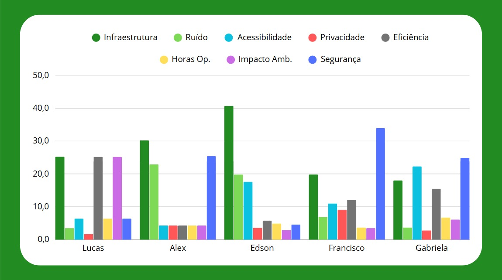

# **Seleção de Sítio para Vertiporto** 

Introdução

## Critérios para Seleção de Sítio ##

- Infraestrutura disponível
- Ruído
- Acessibilidade
- Privacidade
- Eficiência
- Horas de operação
- Impacto ambiental
- Segurança

## AHP (*Processo Hierárquico Analítico*) Individual ##

| Critério/Membro  | Lucas  | Alex   | Edson  | Francisco | Gabriela |
|-----------------|--------|--------|--------|-----------|----------|
| Infraestrutura  | 25,2%  | 30,2%  | 40,7%  | 19,8%     | 18,0%    |
| Ruído          | 3,5%   | 22,9%  | 19,8%  | 6,9%      | 3,7%     |
| Acessibilidade | 6,4%   | 4,3%   | 17,6%  | 11,0%     | 22,3%    |
| Privacidade    | 1,7%   | 4,3%   | 3,6%   | 9,1%      | 2,8%     |
| Eficiência     | 25,2%  | 4,3%   | 5,8%   | 12,1%     | 15,5%    |
| Horas Op.      | 6,4%   | 4,3%   | 4,9%   | 3,7%      | 6,7%     |
| Impacto Amb.   | 25,2%  | 4,3%   | 2,9%   | 3,5%      | 6,1%     |
| Segurança      | 6,4%   | 25,4%  | 4,6%   | 33,9%     | 24,9%    |

**Figura 1 - Resultados individuais para AHP dos oito critérios para escolha de sítio**  
  

*(Fonte: Autor.)* 

---

