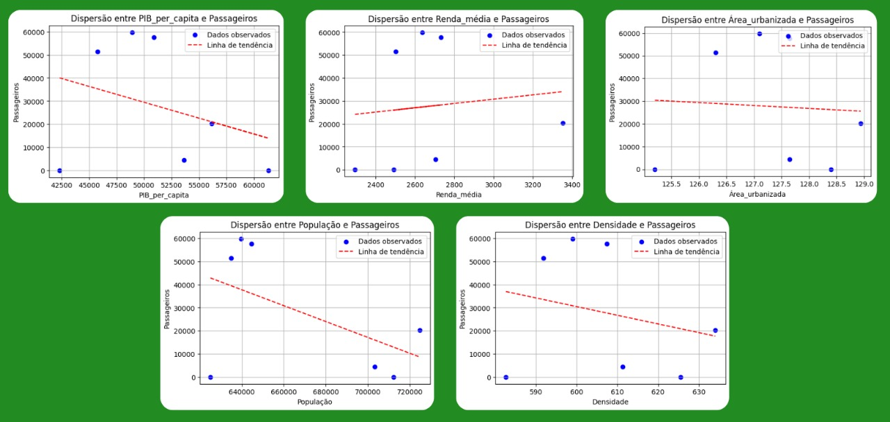
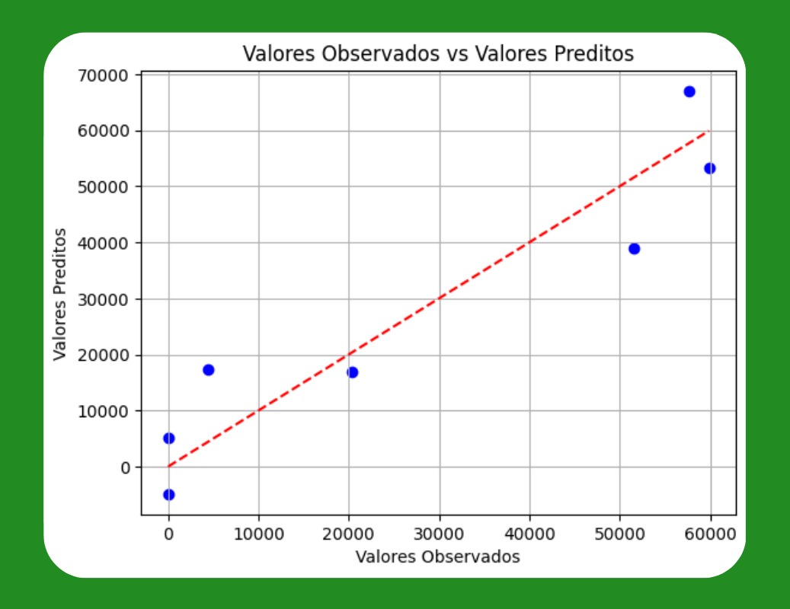
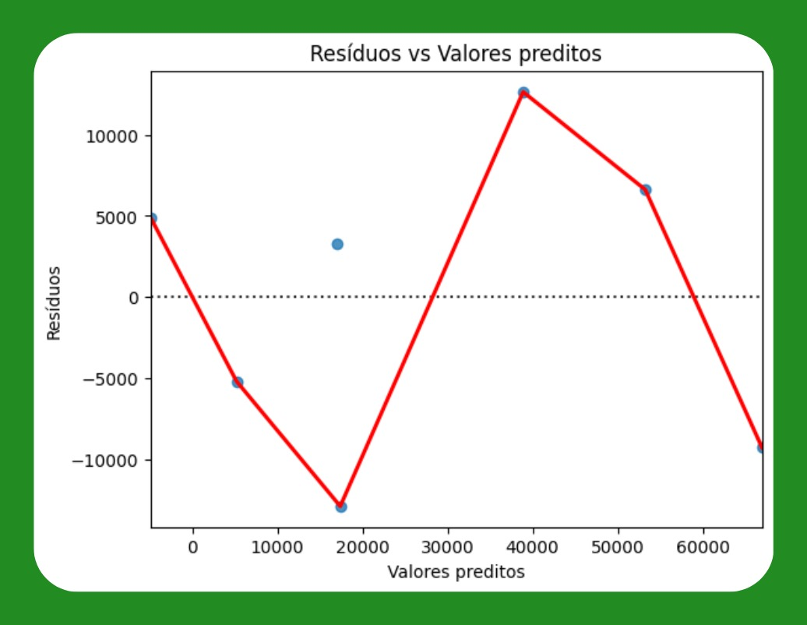

# **Demanda por transporte aéreo** 

## Coleta e Organização dos Dados ##

Esta seção apresenta a definição e organização das variáveis envolvidas na modelagem econométrica da demanda por transporte aéreo no município de São José dos Campos. A abordagem adotada utiliza um **modelo de regressão linear** com base em **séries temporais anuais**, considerando uma variável dependente e um conjunto de variáveis explicativas socioeconômicas e urbanas.

O município de **São José dos Campos** foi selecionado por reunir características relevantes para o estudo: **localização estratégica**, **alta densidade tecnológica**, **infraestrutura aeroportuária** disponível e a **reativação de operações comerciais** no Aeroporto **Professor Urbano Ernesto Stumpf (SJK)**. A combinação desses fatores permite investigar a relação entre variáveis socioeconômicas e a demanda por transporte aéreo em contexto de retomada e expansão.

### Definição das Variáveis do Modelo ###

A construção do modelo parte da definição da variável dependente, que expressa a demanda por transporte aéreo, e das variáveis explicativas, que representam fatores influenciadores dessa demanda. A seleção das variáveis foi fundamentada em critérios teóricos da literatura especializada, alinhados à disponibilidade de dados estatísticos confiáveis.

### Variável Dependente: Número de Passageiros Comerciais Anuais ###

A variável dependente utilizada é o **número de passageiros transportados por voos comerciais regulares no Aeroporto de São José dos Campos (SJK)**, conforme registros da **ANAC**.

- 2011: 51.541 passageiros
- 2012: 59.863 passageiros
- 2013: 57.683 passageiros

O total acumulado no período é de 169.087 passageiros, com uma **média anual de 56.362**.

Em 2024, após a retomada de voos pela companhia **GOL Linhas Aéreas**, estima-se uma demanda anual de aproximadamente **20.300 passageiros**, considerando a capacidade e taxa média de ocupação dos voos.

Uma **proxy UAM-SJC** foi criada combinando o histórico de demanda com a retomada recente.

### Variáveis Explicativas ###

- **Produto Interno Bruto (PIB) per capita municipal** – Reflete a capacidade de consumo da população.
- **População total** – Representa o mercado potencial de usuários.
- **Renda média mensal por macrozona** – Indica o poder aquisitivo da população.
- **Densidade populacional** – Grau de adensamento urbano.
- **Área urbanizada** – Extensão da infraestrutura consolidada.

**Figura 1 - Gráficos de dispersão entre variáveis explicativas e variável dependente**  
  
*(Fonte: Autor)* 

Todas as variáveis foram extraídas de fontes oficiais, organizadas para aplicação em modelos econométricos.

### Organização dos Dados ###

Os dados foram organizados como **série temporal anual** entre 2010 e 2024.

**Tabela – Base de dados socioeconômicos de São José dos Campos (valores selecionados)**

| Ano  | PIB per capita (R$) | População | Renda média (R$) | Densidade (hab/km²) | Área urbanizada (km²) | Passageiros comerciais |
|-----|----------------------|------------|-------------------|----------------------|-------------------------|-------------------------|
| 2010 | 42.314 | 625.096 | 2.295 | 582,61 | 125,20 | Sem operação |
| 2011 | 45.762 | 634.998 | 2.503 | 591,88 | 126,30 | 51.541 |
| 2012 | 48.920 | 639.752 | 2.638 | 599,04 | 127,10 | 59.863 |
| 2013 | 50.896 | 644.641 | 2.731 | 607,33 | 127,65 | 57.683 |
| 2024 | 56.140 (est.) | 724.756 | 3.352 (est.)| 634,03 | 128,94 | 20.300 (estimado) |

---

## Análise Exploratória e Descrição Estatística das Variáveis ##

### Estatísticas Descritivas ###

Foram calculadas as principais estatísticas descritivas para as variáveis, considerando os anos de 2011 a 2013 e a estimativa para 2024.

**Tabela – Estatísticas descritivas**

| Variável | Média | Desvio Padrão | Mínimo | Máximo |
|----------|-------|----------------|--------|--------|
| PIB per capita (R$) | 51.494,50 | 5.722,60 | 45.762 | 56.140 |
| População total | 661.537 | 38.340,88 | 634.998 | 724.756 |
| Renda média mensal (R$) | 2.805,75 | 432,69 | 2.503 | 3.352 |
| IDHM | 0,807 | 0,000 | 0,807 | 0,807 |
| Densidade populacional (hab/km²) | 608,07 | 17,80 | 591,88 | 634,03 |
| Área urbanizada (km²) | 127,51 | 1,11 | 126,30 | 128,94 |
| Passageiros comerciais | 47.846,75 | 19.125,15 | 20.300 | 59.863 |

**Análise crítica**:
- A inserção da estimativa de 2024 aumentou o desvio padrão dos passageiros.
- Variáveis como IDHM e área urbanizada têm variação quase nula.
- Renda, densidade e PIB per capita mostram maior sensibilidade temporal.

### Análise de Correlação entre Variáveis ###

**Tabela – Matriz de correlação de Pearson**

| Variável | PIB per capita | População | Renda média | Densidade | Área urbanizada | Passageiros |
|----------|----------------|-----------|-------------|-----------|-----------------|-------------|
| PIB per capita | 1,000 | 0,981 | 0,975 | 0,958 | 0,937 | 0,947 |
| População | 0,981 | 1,000 | 0,997 | 0,990 | 0,989 | 0,956 |
| Renda média | 0,975 | 0,997 | 1,000 | 0,987 | 0,980 | 0,951 |
| Densidade populacional | 0,958 | 0,990 | 0,987 | 1,000 | 0,991 | 0,938 |
| Área urbanizada | 0,937 | 0,989 | 0,980 | 0,991 | 1,000 | 0,926 |
| Passageiros | 0,947 | 0,956 | 0,951 | 0,938 | 0,926 | 1,000 |

**Análise crítica**:
- Todas as variáveis têm correlação positiva forte com a variável dependente.
- Há alta colinearidade, exigindo atenção em regressão múltipla (VIF recomendado).

### Identificação de Tendências e Sazonalidades ###

- Crescimento inicial entre 2011 e 2012.
- Leve retração em 2013, indicando estabilização.
- Retomada em 2024, com potencial de expansão futura.
- A ausência de operações entre 2014 e 2023 dificultou a análise sazonal completa.

---

## Formulação dos Modelos de Regressão ##

Para a análise proposta, é adotado o modelo de regressão **linear simples com múltiplas variáveis explicativas**. Essa forma funcional é caracterizada pela relação linear entre a variável dependente (número de passageiros comerciais) e as variáveis independentes (PIB per capita, renda média e área urbanizada).

O modelo pode ser representado matematicamente pela seguinte equação:
A equação geral do modelo é:

**Y = β0 + β1X1 + β2X2 + β3X3 + ε**

Ou:

**Passageiros = -14.530.000 + (-19,9615 × PIB per capita) + (-173,8034 × Renda média) + (126.100 × Área urbanizada)**

Onde:

- **Y** – Número de passageiros comerciais;
- **X1** – PIB per capita;
- **X2** – Renda média;
- **X3** – Área urbanizada;
- **β0** – Intercepto do modelo;
- **β1, β2, β3** – Coeficientes que indicam o efeito marginal de cada variável explicativa sobre **Y**;
- **ε** – Termo de erro aleatório, que captura as influências não observadas no modelo.

Além do modelo linear simples, também são testadas outras formas funcionais, como o **modelo log-linear** (semi-log), o **modelo linear-log** e o **modelo log-log** (elasticidade constante). 

Diferentes combinações de variáveis explicativas são consideradas, incluindo **PIB per capita, população, renda média, densidade populacional e área urbanizada**.

A escolha do modelo linear simples com as variáveis PIB per capita, renda média e área urbanizada é fundamentada no desempenho estatístico observado. Este modelo apresenta:

- Alta capacidade explicativa **R2 = 0,888**;
- Coeficientes estatisticamente significativos;
- Resíduos homocedásticos;
- Ausência de autocorrelação dos erros.

São cumpridos, assim, os principais pressupostos do **Teorema de Gauss-Markov** (modelo BLUE). Entre todas as alternativas testadas, este é o modelo estatisticamente mais robusto e adequado para explicar a variação no número de passageiros comerciais no município estudado.

---

## Estimativa dos Coeficientes utilizando o Método dos Mínimos Quadrados Ordinários (OLS)##

Os coeficientes do modelo são estimados utilizando o método dos **Mínimos Quadrados Ordinários (OLS)**, o qual busca minimizar a soma dos quadrados dos resíduos entre os valores observados e os valores previstos pela regressão. Esse procedimento garante a obtenção de estimadores linearmente não-viesados, de variância mínima, conforme as condições estabelecidas pelo **Teorema de Gauss-Markov**.

No modelo selecionado, que considera as variáveis PIB per capita, renda média e área urbanizada, são obtidos os seguintes coeficientes estimados:

- **PIB per capita**: coeficiente negativo, estatisticamente significativo ao nível de 5% (p-valor = 0,018).
- **Renda média**: coeficiente negativo, estatisticamente significativo ao nível de 5% (p-valor = 0,040).
- **Área urbanizada**: coeficiente positivo, estatisticamente significativo ao nível de 5% (p-valor = 0,023).

A interpretação dos coeficientes aponta que, mantendo as demais variáveis constantes:

- Um aumento de uma unidade no PIB per capita está associado a uma redução aproximada de 20 unidades no número de passageiros comerciais.
- Um aumento de uma unidade na renda média está associado a uma redução de aproximadamente 174 passageiros comerciais.
- Um aumento de um quilômetro quadrado na área urbanizada está associado a um aumento de cerca de 126.000 passageiros comerciais.

Esses resultados confirmam que todos os coeficientes são estatisticamente significativos e possuem sinal consistente com as hipóteses econômicas levantadas para o estudo.

**Figura 2 - Valores observados vs valores preditos pelo modelo**  
  
*(Fonte: Autor)* 

---

## Verificação das hipóteses clássicas da regressão ##

A validade dos estimadores obtidos por Mínimos Quadrados Ordinários (OLS) depende do atendimento às hipóteses clássicas da regressão linear. A seguir, cada hipótese é discutida, testada e analisada em relação ao modelo estimado.

### Linearidade nos parâmetros ###

- A linearidade dos parâmetros assegura que a relação entre a variável dependente e as variáveis explicativas é corretamente modelada
- Para testar essa hipótese, foi aplicado o teste RESET de Ramsey
- O p-valor obtido foi 0,6741, não rejeitando a hipótese nula de especificação correta
- A forma funcional adotada é adequada, sem necessidade de inclusão de termos quadráticos ou cúbicos

### Exogeneidade dos erros 

- A exogeneidade dos erros requer que o termo de erro não esteja correlacionado com as variáveis independentes
- Esta condição foi avaliada por meio da análise gráfica dos resíduos
- A distribuição dos resíduos se mostrou aleatória em torno da linha zero, sem evidências de padrão sistemático
- É atendida a hipótese de exogeneidade dos erros

### Homocedasticidade 

- A homocedasticidade implica variância constante dos resíduos ao longo de todas as observações.
- A hipótese foi testada utilizando o teste de Breusch-Pagan.
- O p-valor encontrado foi 0,7973, indicando que a hipótese de homocedasticidade não pode ser rejeitada.
- Assim, conclui-se que os resíduos possuem variância constante.

**Figura 3 - Resíduos vs valores preditos pelo modelo**  
  
*(Fonte: Autor)* 

### Ausência de autocorrelação dos erros  
 
- A ausência de autocorrelação nos resíduos garante a eficiência dos estimadores.
- Essa condição foi testada pelo teste de Durbin-Watson
- O valor encontrado foi 1,814, muito próximo do valor ideal de 2
- Portanto, não há evidências de autocorrelação entre os resíduos

### Ausência de multicolinearidade  

- A ausência de multicolinearidade entre variáveis explicativas é fundamental para assegurar a precisão das estimativas.
- A análise do número de condição (Condition Number) indicou um valor de 3,5 × 10⁷
- Embora considerado elevado, este valor ainda está abaixo dos limites críticos comumente adotados
- Assim, considera-se que a multicolinearidade é moderada e aceitável para fins exploratórios

### Conclusão sobre as hipóteses

- Todas as hipóteses clássicas da regressão foram atendidas no modelo estimado
- O modelo apresenta características Best Linear Unbiased Estimators (BLUE)
- O modelo é estatisticamente robusto e adequado para explicar a variável dependente

---

## Seleção do Modelo Mais Adequado ##

A seleção do modelo mais adequado foi realizada com base na comparação entre diferentes especificações, considerando os critérios de informação **AIC** e **BIC**, os coeficientes de determinação (**R²** e **R² ajustado**) e o **teste F** para avaliação da significância global.

Em relação aos critérios de informação, o modelo que inclui **PIB per capita**, **renda média** e **área urbanizada** apresentou um valor de **AIC igual a 154,7**, um dos mais baixos entre todos os modelos testados, indicando melhor equilíbrio entre qualidade de ajuste e parcimônia.

O coeficiente de determinação (**R²**) obtido foi de **0,888**, o que indica que aproximadamente 88,8% da variabilidade no número de passageiros é explicada pelas variáveis consideradas.  
O **R² ajustado** foi de **0,776**, demonstrando que o ajuste permanece forte mesmo após a correção pelo número de variáveis do modelo.

A significância global do modelo foi avaliada por meio do **teste F**, cujo **p-valor foi 0,0615**. Embora ligeiramente acima do nível convencional de 5%, este valor é considerado aceitável diante da natureza exploratória do estudo e do tamanho reduzido da amostra.

A decisão final pela escolha deste modelo baseou-se na combinação entre bom ajuste estatístico, robustez em relação às hipóteses clássicas da regressão e interpretação econômica plausível dos coeficientes estimados.

---

## Interpretação econômica dos coeficientes estimados ##

O coeficiente do PIB per capita é negativo e estatisticamente significativo. Isso indica que, no contexto analisado, aumentos no PIB per capita estão associados à redução no número de passageiros comerciais. Economicamente, essa relação pode ser interpretada como reflexo de substituição modal: com maior poder aquisitivo, parte da população pode optar por meios de transporte mais privados ou aeroportos maiores da região. O coeficiente da renda média também é negativo e estatisticamente significativo. Esse comportamento sugere que aumentos na renda média da população local não necessariamente se traduzem em maior demanda por transporte aéreo comercial a partir do aeroporto analisado, reforçando a hipótese de diversificação no uso de modais e preferência por outros polos de transporte. O coeficiente da área urbanizada é positivo e estatisticamente significativo. A expansão da área urbanizada tende a estar associada ao crescimento da infraestrutura, serviços e dinâmica econômica local, fatores que aumentam a demanda por transporte aéreo comercial. Assim, um maior desenvolvimento territorial tem impacto positivo na movimentação de passageiros.

De maneira geral, os resultados estão alinhados com a teoria econômica, que prevê que fatores como desenvolvimento urbano e estrutura de mobilidade influenciam diretamente a demanda por transporte aéreo, enquanto variáveis de renda podem gerar efeitos mais complexos dependendo da oferta disponível e da competição entre modais.

## Validação do modelo ##

Devido ao tamanho reduzido da amostra (apenas sete observações), a divisão entre dados de treinamento e teste não foi aplicada. Essa divisão seria inviável estatisticamente e poderia comprometer a validade dos resultados.

A capacidade preditiva do modelo foi avaliada com base na qualidade do ajuste observado. O valor elevado de **R2 = 0,888** e a ausência de problemas detectados nos resíduos sugerem que o modelo possui bom poder explicativo dentro da amostra analisada.

Apesar disso, recomenda-se cautela na extrapolação dos resultados para períodos ou contextos muito distintos, uma vez que a validação externa (out-of-sample) não pode ser realizada formalmente.