# **Localização Ótima de Vertiporto** 

Para **avaliar a escolha do sítio** são usados **critérios** que consideram diversos fatores relevantes, aplicados no método **Processo Hierárquico Analítico** (AHP) para hierarquizar os critérios e alternativas. A **Agregação Individual de Prioridades** (AIP) é então utilizada para consolidar as avaliações de diferentes participantes, gerando uma **avaliação que represente a vontade do grupo**, que posteriormente é **aplicada aos sítios disponíveis** para definir um **sítio que melhor se adeque à proposta**.

## Critérios para Seleção de Sítio ##

- **Infraestrutura disponível** - Facilita a implantação do vertiporto, reduz custos e aproveita serviços urbanos já existentes
- **Ruído** - Evita incômodos à população e garante conformidade com as leis ambientais e urbanas
- **Acessibilidade** - Garante que as pessoas consigam chegar ao vertiporto com facilidade por outros meios de transporte
- **Privacidade** - Evita operações próximas a residências ou áreas sensíveis, reduzindo conflitos e restrições
- **Eficiência** - Favorece o uso prático e estratégico do vertiporto, aproximando-o de zonas com alta demanda
- **Horas de operação** - Evita locais com restrições horárias que possam limitar o funcionamento do vertiporto
- **Impacto ambiental** - Reduz danos ao meio ambiente e facilita o licenciamento e a aceitação pública
- **Segurança** - Minimiza riscos para pedestres, veículos e operações, garantindo um uso mais confiável e legal

---

## AHP (*Processo Hierárquico Analítico*) Individual ##

AHP é uma **metodologia de tomada de decisão** que organiza e analisa complexos problemas através de uma estrutura hierárquica, permitindo **comparar e priorizar alternativas com base em critérios** quantitativos e qualitativos.

**Figura 1 - Resultados individuais para AHP dos oito critérios para escolha de sítio**  
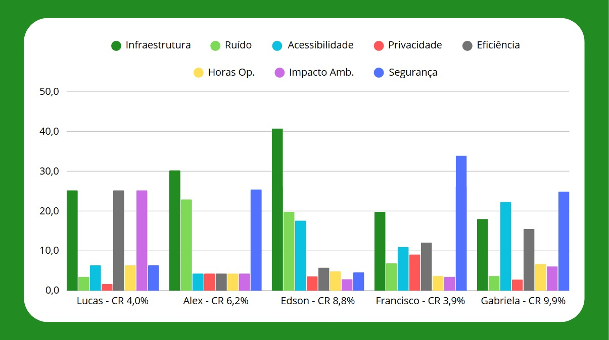  

*(Fonte: Autor)* 

---

## Discussão Sobre Opiniões Individuais ##

- Tendência a valorizar a infraestrutura e segurança
- Tendência a desvalorizar a privacidade e horas de operação
- Tendência de manter a importância do ruído, acessibilidade, impacto ambiental e eficiência como medianos
- Razões de consistência abaixo de 10% 

---

## AIP (*Agregação Individual de Prioridades*) ##

AIP é o **processo de combinar as prioridades individuais** de diferentes pessoas **para obter uma decisão coletiva**.

**Figura 2 - Resultados do grupo para AIP dos oito critérios para escolha de sítio**  
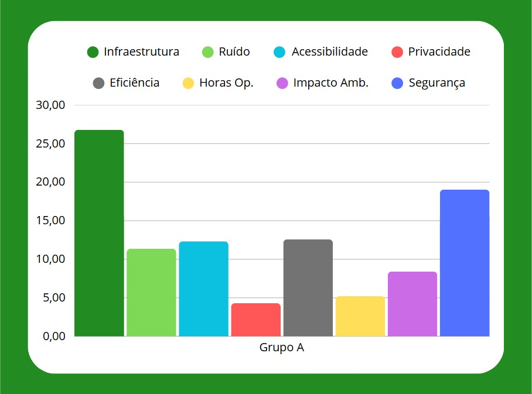

*(Fonte: Autor)* 

---

## Possíveis Sítios ##

### **Aeroporto Internacional de SJC Prof. Urbano E. Stumpf** ###
- O **Aeroporto Internacional de São José dos Campos (SJK Airport)** apresenta-se como um **hub multimodal natural**, com **baixa densidade residencial no entorno** e forte conexão logística, ao concentrar a **indústria aeroespacial**, sobretudo as **operações da Embraer**. Sua **infraestrutura consolidada** — pista, torre de controle e perímetro de segurança — permite a **integração de VTOLs sem necessidade de grandes obras**, ao mesmo tempo em que as **zonas de ruído já mapeadas** garantem **procedimentos de abordagem e decolagem com impacto mitigado** sobre áreas urbanas. Inserido em **espaço aéreo controlado**, o aeroporto exige **coordenação com o DECEA** para definição de trajetórias, mas **beneficia-se de excelente acessibilidade** pela **Rodovia Dutra** e **terminais de ônibus metropolitanos**. Além disso, **protocolos de segurança 24h** e a **proximidade de mananciais e áreas verdes** convidam a **estudos ambientais detalhados**, especialmente quanto ao **manejo de águas pluviais** e à **conservação da fauna local**.

**Potencial**

- O aeroporto já é um **hub de transporte aéreo** na região.  
- A instalação de um **vertiporto permitiria a integração entre voos tradicionais e eVTOLs**, criando um **centro multimodal**.

 **Vantagens**

- **Infraestrutura aeroportuária consolidada**
- **Facilidade de conexão** com voos regionais e nacionais
- **Área disponível para expansão** sem grandes impactos urbanos
- Potencial para atender tanto **passageiros quanto cargas**

**Figura 3 - Sítio Aeroporto SJK no Qgis**  
  
*(Fonte: Autor)* 

### **Bairro Urbanova** ###

- No **bairro Urbanova**, o perfil **residencial planejado** — marcado por **grandes extensões verdes** e **polos acadêmicos como a Universidade do Vale do Paraíba (UNIVAP)** — gera **fluxo constante de estudantes, professores e moradores**, o que justifica a implantação de um **vertiporto voltado a usos acadêmicos e pendulares**. Porém, as **restrições acústicas típicas de zonas residenciais** demandam **operações preferencialmente em horário comercial** e **vetorização cuidadosa do empuxo** para minimizar incômodos. Embora a **proximidade de corredores de aproximação do SJK** requeira **pactuação de trajetórias seguras**, o **transporte pendular** (ida e volta) pelo modal aéreo pode ser uma alternativa às **vias de acesso rodoviário**, ainda que sem oferta de transporte de alta capacidade. A presença de **áreas de preservação permanente ao longo de córregos** enfatiza a importância de **estudos de drenagem** e de **impacto sobre a flora e fauna locais**, bem como a **implantação de soluções de baixo impacto para o entorno**.

**Potencial**

- O Urbanova é um **bairro planejado**, conhecido por abrigar a **Universidade do Vale do Paraíba (UNIVAP)** e por ser uma **área residencial de alto padrão**, com grande potencial para atrair **moradores, estudantes e profissionais** que buscam **mobilidade rápida e eficiente**.

**Vantagens**

- **Proximidade com a UNIVAP**, que poderia utilizar o vertiporto para transporte de pesquisadores e visitantes  
- **Área residencial de alto padrão**, com potencial para atrair moradores que valorizam a mobilidade urbana avançada  
- **Localização estratégica**, próxima a vias importantes como a Rodovia Presidente Dutra  
- **Espaço disponível** para a construção de infraestrutura sem grandes impactos urbanos

**Figura 4 - Sítio Bairro Urbanova no Qgis**  

  
*(Fonte: Autor)* 

### **Parque de Inovação Tecnológica São José dos Campos** ###

- O **Parque de Inovação Tecnológica de São José dos Campos (PIT-SJC)** é um espaço dedicado a **fomentar a ciência, a tecnologia, a inovação e o empreendedorismo**, traduzindo-se em **demanda clara para voos executivos e acadêmicos**. Sua **configuração de campus fechado**, com **vigilância patrimonial** e **corpo de bombeiros próximo**, traz **elevada segurança operacional**, enquanto **corredores rodoviários e ciclofaixas** conectam o local ao restante da cidade com agilidade. Situado **fora do principal CTR do aeroporto**, permite **trâmites simplificados na definição de corredores aéreos**, ao passo que o **perfil misto de uso do solo** admite **maior tolerância a ruído** — sem, é claro, dispensar **estudos de impacto acústico**. A presença de **áreas verdes** e **espelhos d’água remanescentes** reforça a necessidade de um **projeto de paisagismo e drenagem responsáveis**, minimizando possíveis impactos ambientais.

**Potencial**

- O **Parque Tecnológico** é um **polo de inovação e tecnologia**, abrigando **empresas, startups e instituições de pesquisa**. Um vertiporto aqui atenderia principalmente **executivos, pesquisadores e visitantes de alto nível**.

**Vantagens**

- **Proximidade com empresas de tecnologia e aeronáutica**, como a Embraer  
- **Integração natural com o ecossistema de inovação**  
- **Facilidade de conexão com outros modais de transporte**  
- **Infraestrutura já existente** para suportar operações avançadas

**Figura 5 - Sítio Parque Tecnológico no Qgis**  
  

*(Fonte: Autor)* 

### **Shopping Colinas** ###

- O **Shopping Colinas Boulevard** destaca-se pelo **intenso fluxo de público** e pela **extensa área de estacionamento**, que pode ser convertida para uso de **vertiporto sem expansão do perímetro impermeabilizado**. A região circundante, caracterizada por **bairros de alto padrão e forte adensamento residencial**, já convive com **elevados níveis de tráfego rodoviário**, o que confere certa **tolerância a operações de aeronaves VTOL**, desde que sejam previstas **rotas de chegada e saída que evitem poluição sonora adicional**. A **infraestrutura de transporte coletivo em frente ao shopping** e a **disponibilidade de serviços por aplicativo** favorecem a **intermodalidade**, enquanto o **sistema de CFTV e segurança privada** consolida a **proteção dos usuários**. A opção por **reutilizar áreas já pavimentadas** reduz o **impacto na malha urbana** e **facilita a adequação ambiental** do vertiporto.

**Potencial**

- O **Shopping Colinas** é um dos principais **centros de compras e entretenimento** da cidade, frequentado por um **público de renda mais elevada**. Um vertiporto aqui atenderia tanto **clientes quanto executivos**.

**Vantagens**

- **Grande fluxo de pessoas**, justificando a demanda por transporte rápido  
- **Infraestrutura já existente**, como estacionamentos e áreas de apoio  
- **Proximidade com bairros residenciais de alto padrão residencial e comercial**  
- Possibilidade de **integração com serviços de entrega rápida** (logística de e-commerce)

**Figura 6 - Sítio Shopping Colinas no Qgis**  
  
*(Fonte: Autor)* 

**Figura 7 - Mapa com possíveis sítios**  
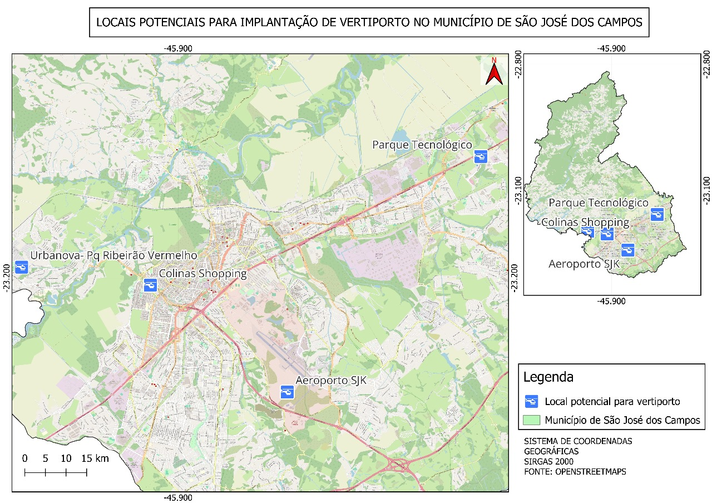 

*(Fonte: Autor)* 

---

## AHP e AIP Sítios ##

Com o **AHP dentre os sítios para cada critério**, é possível definir um **AIP para todas as possibilidades de sítio**.

**Figura 8 - Resultados do grupo para AIP dos quatro sítios de acordo com cada critério**  
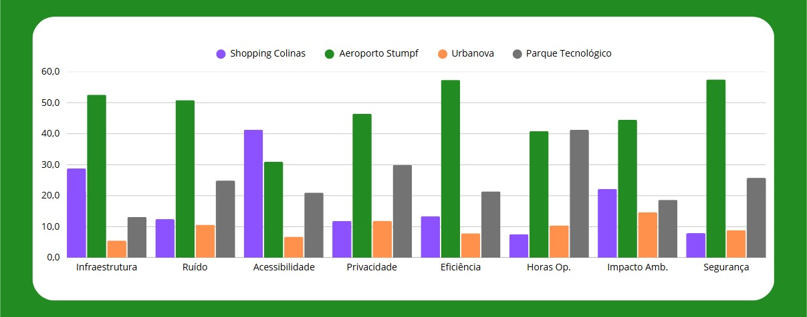

*(Fonte: Autor)* 

Por fim, de acordo com a **prioridade entre os critérios** e a **prioridade entre os sítios de acordo com os critérios**, é possível **definir o sítio no qual o vertiporto será projetado**, que é o **Aeroporto Internacional de São José dos Campos Professor Urbano Ernesto Stumpf**.

**Figura 9 - Resultados de escolha do sítio a partir do AIP para critérios e AIP para sítios**  
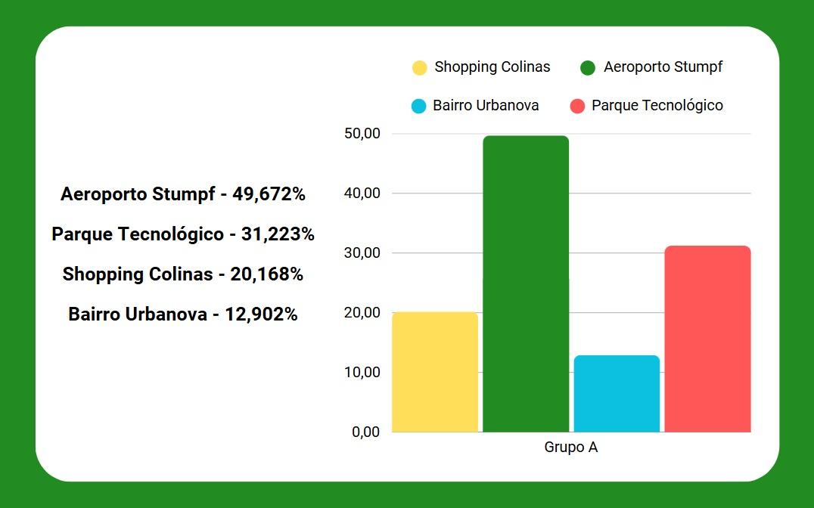

*(Fonte: Autor)* 

---

## Zoneamento e Modelagem de Demanda 

Para **avaliar a demanda** e realizar a **análise de viagens entre vertiportos e macrozonas**, é necessário dividir o espaço urbano em zonas de estudo e aplicar modelos que representem o comportamento de escolha dos usuários, sendo utilizados o **Modelo de Gravidade** e o **Modelo de Huff**, que permitem estimar o fluxo de viagens e a probabilidade de utilização dos vertiportos.

## Divisão em Macrozonas 

A cidade pode ser dividida em **sete regiões geográficas principais**, ou **macrozonas**:  

- Centro  
- Norte 
- Sul  
- Sudeste 
- Leste  
- Oeste  
- Extremo Norte

**Regiões mais populosas**: Leste e Sul  
**Regiões com maior densidade populacional**: Centro e Sul 

**Figura 10 - Número de habitantes e densidade populacional**  
  

*(Fonte: Adaptado de [FGV Atlas OD](https://www.sjc.sp.gov.br/media/56152/atlas_origem_destino_baixa_res.pdf))*  

---

## Renda Per Capita Mensal por Macrozona

- **Regiões com maior renda per capita mensal**:
- Oeste
- Centro
- Sul

**Figura 11 - Renda per capita mensal média**  
  

*(Fonte: Adaptado de [IBGE](https://cidades.ibge.gov.br/brasil/sp/sao-jose-dos-campos/panorama))*  

**Principais Regiões de Origem das Viagens:** 
 
- Sul
- Centro
- Leste

**Principais Regiões de Destino das Viagens:**
  
- Sul
- Leste
- Centro

**Figura 12 - Viagens entre as macrozonas**  
  

*(Fonte: Adaptado de [FGV Atlas OD](https://www.sjc.sp.gov.br/media/56152/atlas_origem_destino_baixa_res.pdf))*   

**Regiões com Maior Mobilidade:** 
 
- Oeste
- Centro
- Leste

**Figura 13 - Índice de mobilidade por região**  
  

*(Fonte: Adaptado de [FGV Atlas OD](https://www.sjc.sp.gov.br/media/56152/atlas_origem_destino_baixa_res.pdf))* 

---

## Zoneamento Urbano e Uso de Solo 

**Divisões de Zoneamento Urbano e Uso de Solo:** 

- Centralidade
- Corredores
- Zonas residenciais
- Zonas de uso diversificado
- Zonas industriais
- Zonas especiais
- Zona aeroportuária
- Zoas de São Francisco Xavier

**Figura 14 - Mapa de uso e ocupação do solo de São José dos Campos**  
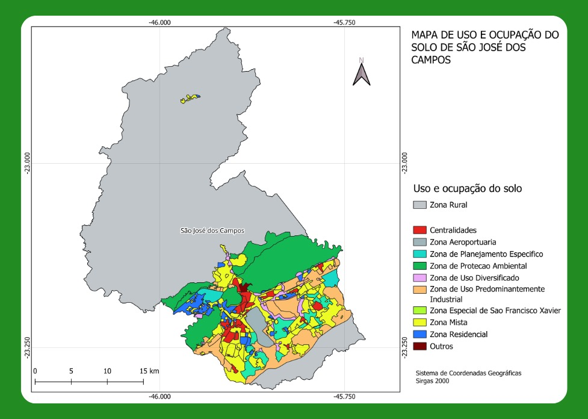  
*(Fonte: Adaptado de [IBGE](https://www.ibge.gov.br/geociencias/organizacao-do-territorio/malhas-territoriais/15774-malhas.html) e [Prefeitura de São José dos Campos](https://www.sjc.sp.gov.br/servicos/urbanismo-e-sustentabilidade/planejamento-urbano/zoneamento/consulta-de-zoneamento/))*  

---

## **Modelo de Gravidade**

O **Modelo de Gravidade** é utilizado para **estimar o número de viagens entre os vertiportos e as macrozonas**, considerando as seguintes variáveis:

- **Tij** – Número estimado de **viagens entre o vertiporto \( i \)** e a **macrozona \( j \)**: Representa o **resultado da equação em formato de matriz**, mostrando o **número estimado de viagens partindo de cada vertiporto para cada macrozona**
- **Pi** – Fator de **produção** associado ao vertiporto \( i \): Representa a capacidade do vertiporto de **gerar viagens**, refletindo o **potencial de suprir a demanda**
- **Aj** – Fator de **atração** da macrozona \( j \): Representa o poder da macrozona de **atrair os usuários**, demonstrando a **tendência das pessoas de irem à essa região**
- **cij** – **Custo de deslocamento** entre \( i \) e \( j \): Representa a **dificuldade ou penalização relacionada à distância entre vertiporto e macrozona**
- **β** – Parâmetro de **impedância**: Representa o **grau de dificuldade ou penalização também relacionada à distância entre vertiporto e macrozona**
- **k** – **Constante de proporcionalidade**: Representa a **escala do modelo**

A formulação geral do modelo é dada por:

**Tij = k × (Pi × Aj) / cijβ**

Para a **aplicação prática do modelo**, são consideradas as seguintes **macrozonas**:

- Centro  
- Norte 
- Sul  
- Sudeste 
- Leste  
- Oeste

Os **vertiportos** definidos são:

- Aeroporto Internacional de SJC Prof. Urbano E. Stumpf
- Bairro Urbanova
- Parque Tecnológico
- Shopping Colinas 

Para o fator de produção **Pi**, é utilizado o critério de **infraestrutura disponível** de cada vertiporto, tendo sido avaliado anteriormente a partir do método **AHP** e **AIP**, considerando uma **nota entre 0 e 100**. Por ser utilizado **um valor que reflete justamente uma maior capacidade do sítio avaliado** anteriormente pelos métodos citados, **é esperado que o sítio com maior demanda de viagens** seja justamente este, ou seja, o **Aeroporto de São José dos Campos**. 

**Figura 15 - Fator de produção de cada vertiporto**  
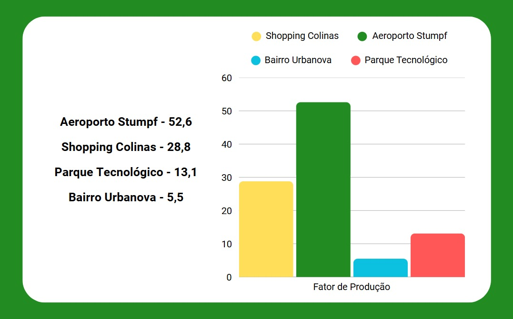  
*(Fonte: Autor)*  

Para o fator de atração **Aj**, é estimado um valor de **0,001% das viagens com destino** a **respectiva macrozona**. O valor utilizado é meramente uma **estimativa**, considerando que **uma pequena parte das viagens realizadas** para cada macrozona se dará a partir do **modal aéreo utilizando aeronaves eVTOL**.

**Figura 16 - Fator de produção de cada macrozona**  
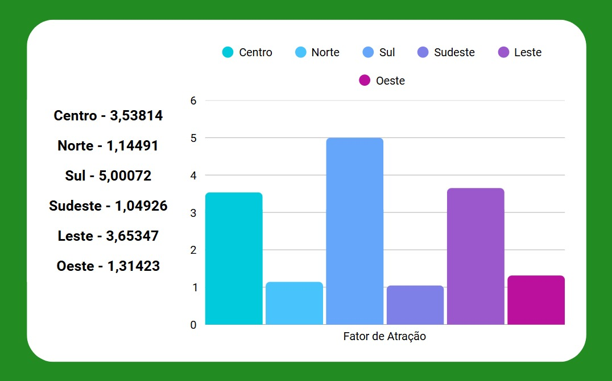  
*(Fonte: Autor)*  

O custo de deslocamento **cij** é obtido a partir da criação de uma matriz com as **distâncias (km) aérea entre cada vertiporto e cada macrozona**.

**Figura 17 - Matriz de distância aérea entre macrozonas e vertiportos**  
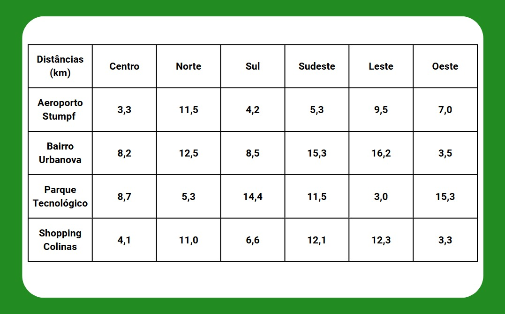  
*(Fonte: Autor)*  

O parâmetro de impedância **β = -0.1** foi estimado a partir de **iterações** . É interessante notar que o parâmetro de impedância, em casos usuais, **penaliza voos mais distantes**, mas no caso de **viagens entre vertiportos em São José dos Campos**, o **valor absoluto de distância é extremamente baixo em todos os casos** (menor que 16,5 km), ou seja, **voos mais distantes** (até 16,5 km) **são desejados para maior eficiência**, já que **viagens de poucos km são mais vantajosas utilizando veículos comuns**, que irão oferecer um tempo de viagem semelhante e menores custos. Após a **estimativa do valor de impedância**, o mesmo **é validado a partir da literatura**, **convergindo para -0,1** - [A demand forecasting model for urban air mobility in Chengdu, China](https://www.sciencedirect.com/science/article/pii/S2773153724000252).

A constante de proporcionalidade **k** é ajustada de forma que os resultados estejam em uma **escala interpretável e coerente** com a quantidade de viagens esperadas, **convergindo para 0,25**. Caso este valor seja superior ao utilizado, a estimativa de demanda irá retornar uma maior quantidade de viagens, mas novamente, conforme descrito anteriormente, é esperado apenas uma pequena quantidade de viagens neste modal.

A aplicação do modelo com os parâmetros definidos resulta na **matriz origem-destino** estimada, que indica o **número relativo de viagens** partindo de cada vertiporto para cada macrozona. Essa matriz permite observar **tendências de fluxo**, identificar **zonas com maior atratividade** e subsidiar decisões sobre **localização ótima de vertiportos**, **planejamento de rotas** e **integração modal**.

**Figura 18 - Matriz de origem-destino entre vertiportos e macrozonas**  
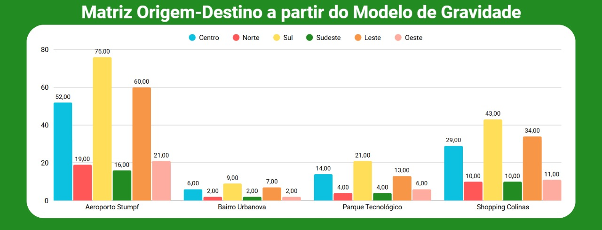  

*(Fonte: Autor)* 

A **matriz origem-destino** revela **tendências de fluxo compatíveis com os perfis de produção e atração definidos**. O **Aeroporto Internacional de São José dos Campos**, com maior fator de produção **Pi** = 52,6 , apresenta os maiores volumes de viagens estimadas, destacando-se nas conexões com o **Sul (76 viagens)** e **Leste (60 viagens)** — macrozonas que, por sua vez, possuem os maiores fatores de atração.

O **Shopping Colinas** também se destaca com **valores expressivos**, especialmente em direção ao **Sul (43)** e ao **Leste (34)**, refletindo tanto seu **potencial comercial** quanto sua **boa localização relativa** e **baixa distância penalizada** pelo valor negativo de **β** = -0.1. Esse valor de **β**, ao **inverter o efeito tradicional da impedância**, favorece deslocamentos um pouco mais longos, alinhados à lógica de que **viagens muito curtas tendem a ser supridas por meios terrestres convencionais**.

Já o **Parque de Inovação Tecnológica** e o **Urbanova** apresentam valores mais modestos, consistentes com seus **menores fatores de produção** e com sua **localização mais periférica** em relação às zonas de maior atração.

A matriz gerada fornece um panorama inicial bastante útil para:

- **Priorizar investimentos** em vertiportos com maior potencial de geração de viagens;
- **Compreender a relação espacial entre origem e destino** em contextos urbanos de média escala;
- **Refinar trajetórias e horários operacionais**, especialmente para evitar sobreposição de rotas em regiões sensíveis;
- **Apoiar decisões sobre fases de implementação** e escalonamento da infraestrutura.

É **importante destacar** que o estudo realizado possui limitações devido a abordagem e aos dados utilizados. Essas limitações se dão principalmente pelo uso de dados estabelecidos empiricamente, como é o caso do fator de produção e do fator de atratividade, definidos a partir da priorização de critérios e análise empírica dos sítios, e da percepção de uma pequena quantidade de viagens adotadas inicialmente, ou seja, por serem utilizadas estimativas que refletem as escolhas dos autores, os resultados seguem uma tendência de mostrar o que já era esperado ainda durante os estudos de critérios dos sítios. 

Ainda, **uma forma de mitigar essas tendências e aumentar a qualidade do estudo** seria **utilizar de dados que possuem menor correlação com as escolhas dos autores e que sejam validados**, como a **percepção dos usuários finais das aeronaves eVTOL, ou seja, os passageiros**. Também é interessante citar que **diferentes dados usados para o modelo podem gerar diferentes estimativas de demanda**, ou seja, e**m cenários que outros critérios sejam avaliados, o sítio ótimo poderia ser outro**.  

---

## **Modelo de Huff**

O **Modelo de Huff** é utilizado para **estimar a probabilidade de escolha de um vertiporto por parte de usuários de diferentes macrozonas**, com base na **atratividade da alternativa** e na **distância percorrida para acessá-la**. Esse modelo é particularmente útil para **analisar o comportamento de decisão dos usuários** diante de múltiplas opções de transporte. São consideradas as seguintes variáveis:

- **Pij** – **Probabilidade de um usuário da macrozona \( i \) escolher o vertiporto \( j \)**: Representa o **peso relativo da escolha do vertiporto** diante das demais alternativas disponíveis
- **Aj** – **Atratividade do vertiporto \( j \)**: Representa a **atratividade completa do vertiporto com base em todos os critérios de seleção de sítio** descritos anteriormente
- **cij** – **Custo de deslocamento entre a macrozona \( i \) e o vertiporto \( j \)**: Expressa a **distância ou tempo de deslocamento**
- **λ** – **Parâmetro de sensibilidade à distância**: Controla o **quanto o custo influencia negativamente a escolha**
- **n** – **Número de alternativas disponíveis**: Representa o **conjunto de vertiportos considerados no somatório**

A formulação geral do modelo é dada por:

**Pij = (Aj / cijλ) / Σ(Ak / cikλ)**

Para a **aplicação prática do modelo**, são utilizadas as **mesmas macrozonas e vertiportos** definidas no Modelo de Gravidade.

A **atratividade Aj** de cada vertiporto é atribuída com base na **decisão final de escolha de sítio**, ou seja, a **nota final para os oito critérios de avaliação**, conforme concluído pelos métodos **AHP** e **AIP** anteriormente.

O **custo de deslocamento cij** é o mesmo utilizado no modelo anterior, baseado nas **distâncias aéreas entre macrozonas e vertiportos**.

O **parâmetro de sensibilidade à distância λ = -0,1** foi definido com base em iterações de acordo com o comportamento das probabilidades no resultado na equação, de forma a manter a atratividade de utilizar viagens com eVTOLs para destinos mais distantes, aumentando a eficiência da viagem, de forma semelhante ao descrito anteriormente.

A aplicação do modelo resulta na **matriz de probabilidades Pij**, representando a **probabilidade de um usuário de cada macrozona escolher cada vertiporto como ponto de partida ou chegada**.

**Figura 19 - Matriz de probabilidades de escolha entre macrozonas e vertiportos**  
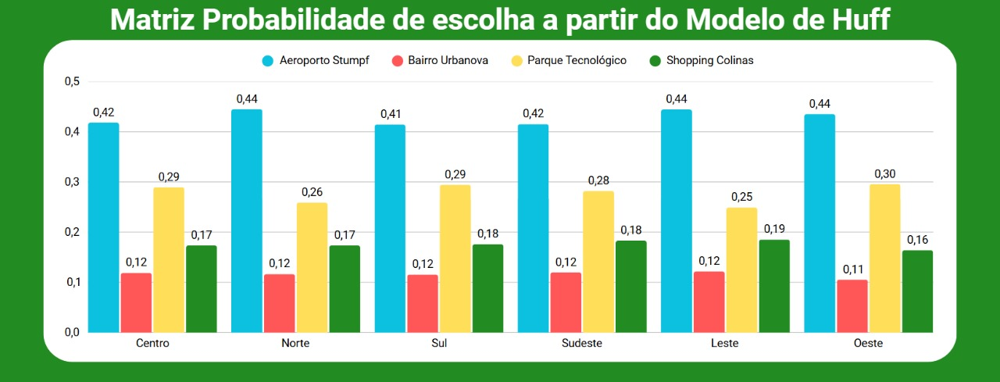  

*(Fonte: Autor)*

A **aplicação do Modelo de Huff** resultou em uma **matriz de probabilidades de escolha** para cada vertiporto, considerando a **nota final de atratividade atribuída a partir de 8 critérios multicritério** (e não apenas infraestrutura), além da penalização da distância por meio do parâmetro **λ = -0,1**.

Os resultados demonstram que o **Aeroporto Internacional de SJC** mantém as **maiores probabilidades de escolha** em praticamente todas as macrozonas, com valores variando entre **41% e 44%**, o que reflete sua **alta atratividade total (49,672)**, aliada a **distâncias competitivas** mesmo em macrozonas mais afastadas.

O **Parque Tecnológico**, com nota de atratividade intermediária (**31,223**), apresenta **probabilidades médias**, entre **24% e 29%**, mostrando forte preferência relativa especialmente nas zonas **Sul, Oeste e Centro**, onde sua posição geográfica e o equilíbrio com os custos de deslocamento geram vantagem comparativa.

O **Shopping Colinas**, embora com menor nota geral (**20,168**), mantém **probabilidades consistentes** na faixa de **16% a 18%**, sugerindo que **a boa localização e a facilidade de acesso** compensam, em parte, sua atratividade mais modesta.

O **Urbanova**, com a menor nota de atratividade geral (**12,902**), apresenta **as menores probabilidades em todas as macrozonas**, com valores abaixo de **12%**, refletindo seu **perfil mais restrito de uso** e **localização periférica** em relação aos polos urbanos mais ativos.

Essa análise por probabilidades:

- **Reflete o comportamento provável de escolha dos usuários**, em um cenário com múltiplas opções disponíveis
- **Complementa a matriz de gravidade** ao considerar **não apenas a intensidade de fluxo**, mas também a **distribuição relativa da preferência**
- Permite visualizar **como a atratividade total afeta diretamente a decisão do usuário**, mesmo diante de distâncias diferentes
- Auxilia na **priorização de investimentos e definição de políticas operacionais** para cada vertiporto

É **importante destacar** que, de forma semelhante para o modelo de gravidade, o estudo realizado com o modelo de Huff também possui limitações devido a abordagem e aos dados utilizados. Essas limitações se dão, de forma semelhante, pelo uso de estimativas que refletem as escolhas dos autores, portanto, os resultados seguem uma tendência de mostrar o que já era esperado ainda durante os estudos de critérios dos sítios. Nos dois casos os parâmetros de sensibilidade **β** e **λ** foram ajustados para diminuir essa tendência e aumentar a influência do que é importante para a eficácia deste tipo de transporte aéreo em curtas distâncias absolutas, o que é perceptível em ambos os resultados a partir do número de viagens e chance de escolha, mesmo que não superior, mas próximo, entre os valores das macrozonas e vertiportos que possuem maior atratividade e os valores das macrozonas e vertiportos que possuem maior distância, ou seja, maior eficiência.

Por fim, análise conjunta dos modelos de **Gravidade** e **Huff** revela **resultados consistentes**, mas com **ênfases distintas**: enquanto o Modelo de Gravidade foca na **quantidade estimada de viagens entre origens e destinos**, o Modelo de Huff se concentra na **probabilidade relativa de escolha entre alternativas**.

No Modelo de Gravidade, os vertiportos com **maior fator de produção** e **melhor posicionamento geográfico** — como o **Aeroporto Internacional de SJC** e o **Shopping Colinas** — concentram a maior parte dos **fluxos totais estimados**. Já o Modelo de Huff, ao incorporar **comportamento de escolha**, reforça a **preferência pelo Aeroporto** devido à sua **alta atratividade global**, mas também destaca como **vertiportos medianamente atrativos**, como o **Parque Tecnológico**, podem alcançar **relevância em zonas específicas**.

Além disso, o Modelo de Huff evidencia que mesmo alternativas com menor atratividade, como o **Urbanova**, mantêm **alguma participação proporcional**, ainda que reduzida, ao passo que o Modelo de Gravidade pode atribuir valores muito baixos ou nulos em termos absolutos.

Em conjunto, os dois modelos oferecem uma **visão complementar**: o **Gravidade projeta demanda em volume**, enquanto o **Huff interpreta a escolha com base na atratividade e acessibilidade relativa**, ampliando a qualidade da tomada de decisão para a **localização e operação de vertiportos urbanos**.

