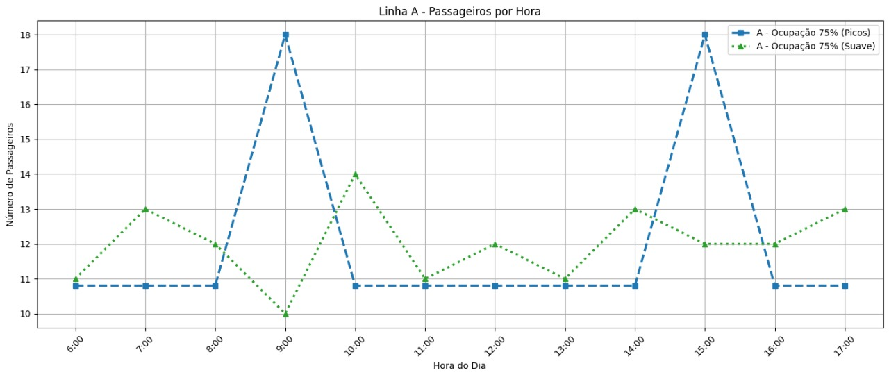
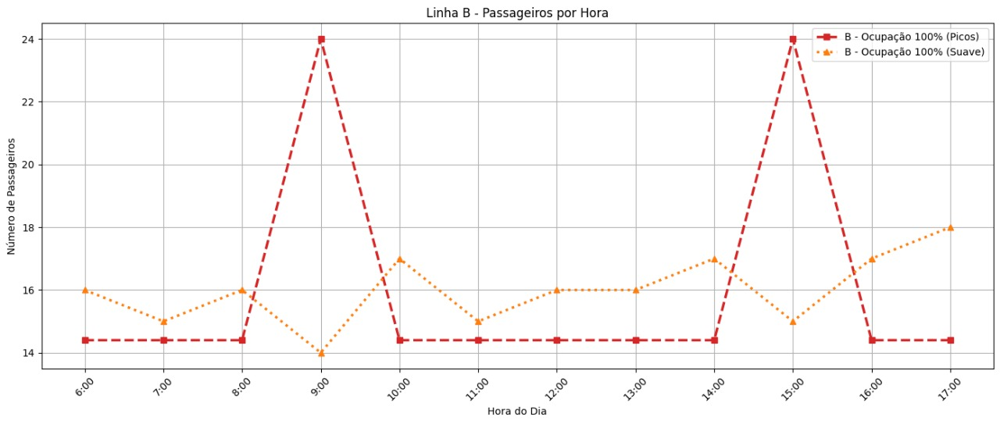
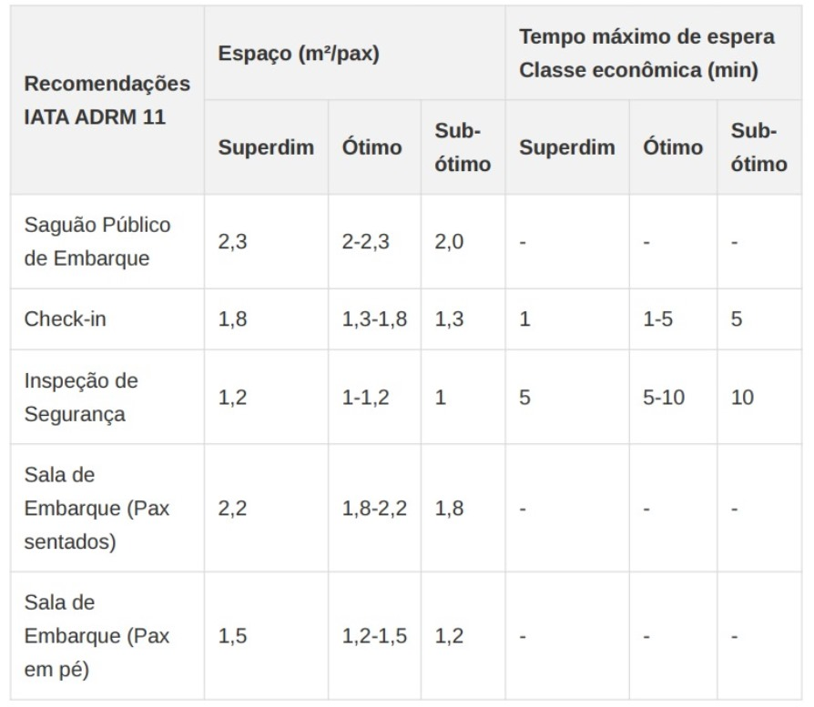
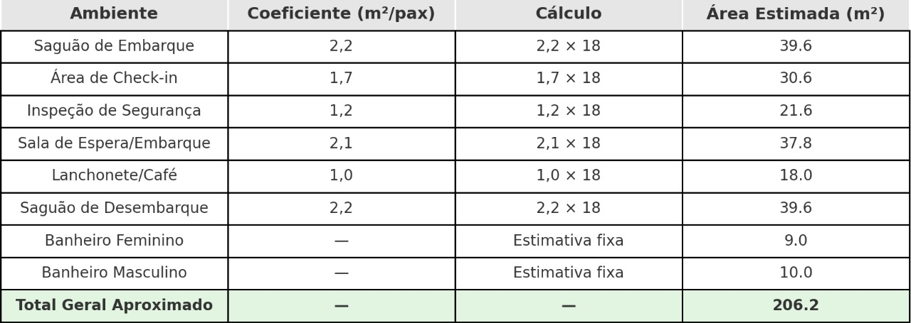
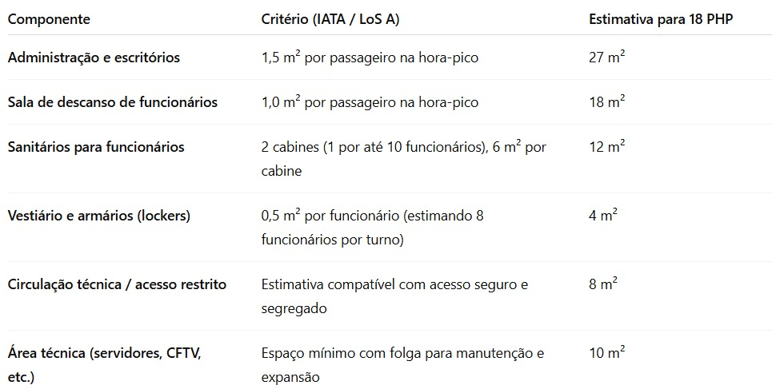
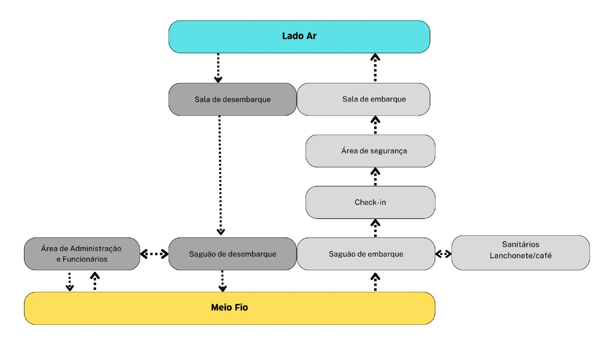

# **Projeto Conceitual do lado terra** 

Para o **projeto do lado terra do vertiporto**, é considerada uma **estimativa de passageiros ao longo do dia e também em picos**, para posteriormente **dimensionar as partes do vertiporto de acordo com a capacidade necessária** para comportar a operação.

## Estimativa de Passageiros ##

Considerando uma **operação diária de 12 horas**, com dois stands ocupados simultaneamente em média e tempo de solo de 30 minutos por aeronave, estima-se um **total de 48 operações diárias**. Cada aeronave possui **capacidade para 4 passageiros** por viagem. Com uma **taxa de ocupação de 75%**, isso resulta em **144 passageiros** transportados por dia. No cenário de **ocupação total (100%)**, a capacidade diária alcança **192 passageiros**.

Para cada taxa de ocupação, são considerados dois cenários distintos de distribuição do fluxo de passageiros ao longo do dia. O primeiro cenário caracteriza-se por um fluxo suave, com variações graduais e moderadas em torno da média horária, refletindo uma demanda constante e equilibrada. O segundo cenário contempla a ocorrência de dois períodos de pico, nos quais a concentração de passageiros é significativamente maior, enquanto nas demais horas a movimentação permanece em níveis médios. Na figura 1 é mostrada a comparação entre os cenários A (com 75% de ocupação) considerando dois picos de passageiros e também uma distribuição suave ao longo do dia.  

**Figura 1 - Estimativa de passageiros ao longo da operação diária para ocupação A - 75% com dois picos e distribuição suave**  
  

*(Fonte: Autor)* 

Na figura 2 é mostrada a comparação entre os cenários B (com 100% de ocupação) considerando dois picos de passageiros e também uma distribuição suave ao longo do dia.

**Figura 2 - Estimativa de passageiros ao longo da operação diária para ocupação B - 100% com dois picos e distribuição suave**  
  

*(Fonte: Autor)* 

## Dimensionamento dos Componentes Lado Terra ##

Para o dimensionamento do lado terra, são considerados três cenários de demanda:

- Cenário pessimista: 96 passageiros/dia (50% de ocupação), com pico de 12 passageiros/hora
- Cenário realista: 144 passageiros/dia (75% de ocupação), com pico de 18 passageiros/hora
- Cenário realista: 192 passageiros/dia (100% de ocupação), com pico de 24 passageiros/hora

Além disso, é considerado também uma possível expansão futura para atender um aumento de até 40% na demanda.

 O dimensionamento de terminais de passageiros tradicionalmente segue metodologias estabelecidas por órgãos como IATA, FAA e ICAO, além de referências acadêmicas como Medeiros (2004) e Ashford et al. (2011). No entanto, para vertiportos, por se tratar de uma tipologia emergente, foi necessário adaptar esses parâmetros considerando: 

- Escala reduzida: Vertiportos operam com aeronaves menores (eVTOLs) e fluxos de passageiros mais limitados em comparação a aeroportos convencionais
- Simplicidade operacional: Processos mais ágeis e menos complexos, com tempos de permanência reduzidos
- Integração urbana: Necessidade de otimização espacial devido à inserção em contextos urbanos com limitações de área
- Flexibilidade: Capacidade de adaptação a diferentes cenários de demanda e evolução tecnológica

Para o dimensionamento do terminal, são utilizadas as recomendações da IATA (2019) para terminais aeroportuários, adaptados ao contexto de um vertiporto.

É adotado o índice de dimensionamento para terminal regional com nível de serviço A (alto), resultando em 15,00 m²/pax. Este valor é ajustado considerando as particularidades operacionais de um vertiporto, que possui fluxos mais simplificados em comparação a aeroportos convencionais.

**Figura 3 - Recomendações IATA ADRM 11 - Espaço e Tempo de Espera**  
  

Com base nas recomendações da IATA, foram adotados os seguintes parâmetros específicos para cada ambiente:
- Saguão de Embarque: 2,2 m² por passageiro em hora-pico (nível ótimo)
- Área de Check-in: 1,7 m² por passageiro em hora-pico (nível ótimo) 
- Sala de Espera/Embarque: 2,1 m² por passageiro em hora-pico (nível ótimo)
- Lanchonete/Café: 1,0 m² por passageiros em hora-pico 
- Saguão de desembarque: 2,2 m² por passageiro em hora-pico (nível ótimo)

Para o dimensionamento de sanitários públicos adotamos os parâmetros estabelecidos pelo Código Sanitário do Estado de SP (Decreto nº 12.342/1978) e ABNT NBR 9050:2015 (Acessibilidade). Assim, é necessária ao menos 1 cabine acessível por sanitário, com dimensões mínimas de 1,50 m x 1,70 m, e para edificações de uso público com área entre 151 m² e 500 m², como terminais de passageiros é necessário a separação por sexo e os seguintes requisitos:

Sanitário Masculino: 2 bacias, 2 lavatórios e 2 mictórios.

Sanitário Feminino: 2 bacias e 2 lavatórios.

Estimativas de área mínima
Banheiro feminino: 9 m²

Banheiro masculino: 10 m²

Somando-se as áreas de todos os compontentes, o total estimado para as áreas de acesso ao público será de 206.2

**Figura 4 - Dimensionamento dos ambientes do Terminal para o cenário realista**  
  

Para estimar o dimensionamento de componentes de Administração e apoio a funcionários, utilizamos como base os dados da IATA – Airport Development Reference Manual (ADRM, 12ª edição).

**Figura 5 - Dimensionamento dos ambientes de Administração**  
 

O total estimado de área destinada à administração será de 79m².

Somando-se as áreas previstas para acesso ao público com a área destinada a administração totaliza uma área de 285.2m²

O fluxograma abaixo ilustra o fluxo de passageiros bem como o acesso e proximidade de cada componente dentro do terminal de passageiros, desde o meio fio até o lado ar.

**Figura 6 - Fluxo de passageiros**  
 

## Planta do Lado Terra ##
 

Área para Expansão Futura: Espaço reservado para ampliação do terminal, permitindo aumento de 40% na capacidade conforme recomendado por Medeiros (2004). Assim, uma área de 114m² será reservada para futura expansão. 

## Referências ##

- ABNT NBR 9050:2020 - Acessibilidade a edificações, mobiliário, espaços e equipamentos urbanos
- ABNT NBR 9077:2001 - Saídas de emergência em edifícios
- ABNT NBR 16401:2008 - Instalações de ar-condicionado - Sistemas centrais e unitários
- ABNT NBR 5410:2004 - Instalações elétricas de baixa tensão
- ABNT NBR 5419:2015 - Proteção contra descargas atmosféricas
- ABNT NBR 10844:1989 - Instalações prediais de águas pluviais
 
---

- Manual de Projetos Aeroportuários - Ministério da Infraestrutura
- Manual de Anteprojeto - ANAC
- RBAC 154 - Projeto de Aeródromos
- RBAC 156 - Segurança Operacional em Aeródromos
- ICA 11-408 - Estações Prestadoras de Serviços de Telecomunicações e de Tráfego Aéreo (EPTA)
- ICA 63-19 - Critérios de Análise Técnica da Área de Aeródromos

---

- UAM Concept of Operations - Federal Aviation Administration (FAA)
- Vertiport Design Guidelines - European Union Aviation Safety Agency (EASA)
- Skyports Infrastructure Design Standards - Referência para vertiportos urbanos
- NEXA Advisors UAM Study - Parâmetros para infraestrutura de mobilidade aérea urbana
- IATA Airport Development Reference Manual (ADRM) 11th Edition - International Air Transport Association (2019)

---

- MEDEIROS, A. G. M. Metodologia para o planejamento de terminais de passageiros modulares e expansíveis. Tese de Doutorado, Instituto Tecnológico de Aeronáutica, São José dos Campos, 2004.
- ASHFORD, N.; MUMAYIZ, S.; WRIGHT, P. Airport Engineering: Planning, Design and Development of 21st Century Airports. 4th ed. Wiley, 2011.
- HORONJEFF, R.; MCKELVEY, F.; SPROULE, W.; YOUNG, S. Planning and Design of Airports. 5th ed. McGraw-Hill, 2010.
- STBA. Service Technique des Bases Aériennes. Méthode de dimensionnement des aérogares passagers. Paris, 1983.

---

- Lei Federal nº 10.098/2000 - Normas gerais e critérios básicos para a promoção da acessibilidade
- Decreto Federal nº 5.296/2004 - Regulamenta as Leis nº 10.048/2000 e 10.098/2000 
- Código de Obras e Edificações - Município de São José dos Campos
- Plano Diretor - Município de São José dos Campos
- Normas do Corpo de Bombeiros - Estado de São Paulo
