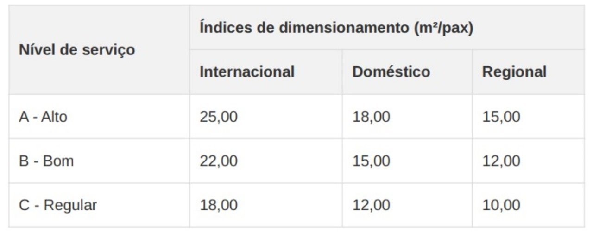

# **Projeto Conceitual do lado terra** 

Para o **projeto do lado terra do vertiporto**, é considerada uma **estimativa de passageiros ao longo do dia e também em picos**, para posteriormente **dimensionar as partes do vertiporto de acordo com a capacidade necessária** para comportar a operação.

## Estimativa de Passageiros ##

Considerando uma **operação diária de 12 horas**, com dois stands ocupados simultaneamente em média e tempo de solo de 30 minutos por aeronave, estima-se um **total de 48 operações diárias**. Cada aeronave possui **capacidade para 4 passageiros** por viagem. Com uma **taxa de ocupação de 75%**, isso resulta em **144 passageiros** transportados por dia. No cenário de **ocupação total (100%)**, a capacidade diária alcança **192 passageiros**.

Para cada taxa de ocupação, são considerados dois cenários distintos de distribuição do fluxo de passageiros ao longo do dia. O primeiro cenário caracteriza-se por um fluxo suave, com variações graduais e moderadas em torno da média horária, refletindo uma demanda constante e equilibrada. O segundo cenário contempla a ocorrência de dois períodos de pico, nos quais a concentração de passageiros é significativamente maior, enquanto nas demais horas a movimentação permanece em níveis médios. Na figura 1 é mostrada a comparação entre os cenários A (com 75% de ocupação) considerando dois picos de passageiros e também uma distribuição suave ao longo do dia.  

**Figura 1 - Estimativa de passageiros ao longo da operação diária para ocupação A - 75% com dois picos e distribuição suave**  
  

*(Fonte: Autor)* 

Na figura 1 é mostrada a comparação entre os cenários B (com 100% de ocupação) considerando dois picos de passageiros e também uma distribuição suave ao longo do dia.

**Figura 2 - Estimativa de passageiros ao longo da operação diária para ocupação B - 100% com dois picos e distribuição suave**  
  

*(Fonte: Autor)* 

## Dimensionamento dos Componentes Lado Terra ##

Para o dimensionamento do lado terra, são considerados três cenários de demanda:

- Cenário pessimista: 96 passageiros/dia (50% de ocupação), com pico de 12 passageiros/hora
- Cenário realista: 144 passageiros/dia (75% de ocupação), com pico de 18 passageiros/hora
- Cenário realista: 192 passageiros/dia (100% de ocupação), com pico de 24 passageiros/hora

Além disso, é considerado também uma possível expansão futura para atender um auemnto de até 40% na demanda.

Para o dimensionamento do terminal, são utilizados os índices de dimensionamento da STBA (1983), conforme apresentado por Medeiros (2004), e as recomendações da IATA (2019) para terminais aeroportuários, adaptados ao contexto de um vertiporto. 

Na figura 1 é mostrada a comparação entre os cenários B (com 100% de ocupação) considerando dois picos de passageiros e também uma distribuição suave ao longo do dia.

**Figura 3 - Área total do TPS - Índices de dimensionamento (m²/pax)**  
  

É adotado o índice de dimensionamento para terminal regional com nível de serviço B (Bom), resultando em 12,00 m²/pax. Este valor é ajustado considerando as particularidades operacionais de um vertiporto, que possui fluxos mais simplificados em comparação a aeroportos convencionais.

**Figura 4 - Recomendações IATA ADRM 11 - Espaço e Tempo de Espera**  
  

Com base nas recomendações da IATA, foram adotados os seguintes parâmetros específicos para cada ambiente:
- Saguão de Embarque/Desembarque: 2,3 m² por passageiro em hora-pico (nível superdimensionado)
- Área de Check-in: 1,8 m² por passageiro em hora-pico (nível superdimensionado) 
- Sala de Espera/Embarque: 1,2 m² por passageiro em hora-pico (nível subótimo para pax em pé)
- Sanitários: Conforme NBR 9050:2020
- Lanchonete/Café: 1,0 m² por 30% dos passageiros em hora-pico (adaptado da IATA)

**Figura 5 - Dimensionamento dos ambientes do Terminal para o cenário realista**  
  

O projeto foi dimensionado para três cenários de demanda, conforme solicitado:
- Cenário Pessimista (96 pax/dia): Área total de 125,30 m²
- Cenário Realista (144 pax/dia): Área total de 164,30 m²
- Cenário Otimista (192 pax/dia): Área total de 215,30 m²
- Expansão Futura (+40%): Área total de 301,42 m²

## Planta do Lado Terra ##
 
Saguão de Embarque/Desembarque (27 m²): Área principal de acesso ao terminal, com portas automáticas e espaço para circulação e espera. Dimensionado conforme parâmetro IATA de 2,3 m²/pax para nível superdimensionado.

Área de Check-in (33 m²): Espaço para atendimento e despacho de passageiros, com balcões de atendimento e área para filas. Dimensionado conforme parâmetro IATA de 1,8 m²/pax para nível superdimensionado.

Sala de Espera/Embarque (22 m²): Ambiente com assentos para aguardar o embarque, localizado próximo à saída para a área de pouso e decolagem.Dimensionado conforme parâmetro IATA de 1,2 m²/pax para nível sub-ótimo.

Sanitários (19,30 m²): Conjunto de sanitários masculino, feminino e acessível (PCD), conforme NBR 9050:2020. Posicionados de forma central, com acesso a partir da circulação principal.

Lanchonete/Café (15 m²): Área para alimentação rápida, com balcão de atendimento e algumas mesas. Dimensionado considerando 1,0 m² para 30% dos passageiros em hora-pico.

Área Administrativa/Back-office (14 m²): Escritório para gestão do terminal, com estações de trabalho e equipamentos administrativos. Dimensionado conforme recomendações da ANAC para áreas administrativas em terminais aeroportuários.

Sala de Funcionários (12 m²): Espaço de descanso e apoio para colaboradores, com armários, pequena copa e área de estar. Dimensionado considerando 1,5 m² por funcionário.

Depósito/Área Técnica (10 m²): Ambiente para armazenamento de equipamentos, materiais de limpeza e manutenção. Dimensionado conforme recomendações IATA para áreas de apoio.

Área de Segurança (12 m²): Espaço para controle de acesso e monitoramento de segurança, com equipamentos de CFTV e comunicação. Dimensionado conforme recomendações do DECEA para áreas de segurança em instalações aeroportuárias.

Circulação Principal: Eixo central de circulação, conectando todos os ambientes do terminal e garantindo fluxo eficiente de passageiros e funcionários. Dimensionado conforme NBR 9050:2020.

Área para Expansão Futura: Espaço reservado para ampliação do terminal, permitindo aumento de 40% na capacidade conforme recomendado por Medeiros (2004).

O dimensionamento de terminais de passageiros tradicionalmente segue metodologias estabelecidas por órgãos como IATA, FAA e ICAO, além de referências acadêmicas como Medeiros (2004) e Ashford et al. (2011). No entanto, para vertiportos, por se tratar de uma tipologia emergente, foi necessário adaptar esses parâmetros considerando: 

- Escala reduzida: Vertiportos operam com aeronaves menores (eVTOLs) e fluxos de passageiros mais limitados em comparação a aeroportos convencionais
- Simplicidade operacional: Processos mais ágeis e menos complexos, com tempos de permanência reduzidos
- Integração urbana: Necessidade de otimização espacial devido à inserção em contextos urbanos com limitações de área
- Flexibilidade: Capacidade de adaptação a diferentes cenários de demanda e evolução tecnológica

A área total do terminal (164,30 m²) é validada através de três abordagens complementares:

- Método comparativo: Análise de vertiportos similares, como o projeto do Reino Unido com 160 m² (referência internacional)
- Método analítico: Aplicação do índice de dimensionamento da STBA (1983) para terminal regional com nível de serviço B (12,00 m²/pax), resultando em 18 pax (hora-pico) × 12,00 m²/pax × 0,75 (fator de ajuste para vertiportos) = 162 m²
- Método sintético: Somatório das áreas individuais dimensionadas conforme parâmetros específicos, resultando em 164,30 m².

Considerando o aumento de 40% na capacidade, a expansão prevê:

- Capacidade atual (cenário realista): 144 pax/dia, pico de 18 pax/hora
- Capacidade após expansão: 202 pax/dia, pico de 25 pax/hora
- Área atual: 164,30 m²
- Área após expansão: 301,42 m²
- Área adicional necessária: 86,12 m²
- Área de expansão prevista: 90 m²

## Referências ##

- ABNT NBR 9050:2020 - Acessibilidade a edificações, mobiliário, espaços e equipamentos urbanos
- ABNT NBR 9077:2001 - Saídas de emergência em edifícios
- ABNT NBR 16401:2008 - Instalações de ar-condicionado - Sistemas centrais e unitários
- ABNT NBR 5410:2004 - Instalações elétricas de baixa tensão
- ABNT NBR 5419:2015 - Proteção contra descargas atmosféricas
- ABNT NBR 10844:1989 - Instalações prediais de águas pluviais
 
---

- Manual de Projetos Aeroportuários - Ministério da Infraestrutura
- Manual de Anteprojeto - ANAC
- RBAC 154 - Projeto de Aeródromos
- RBAC 156 - Segurança Operacional em Aeródromos
- ICA 11-408 - Estações Prestadoras de Serviços de Telecomunicações e de Tráfego Aéreo (EPTA)
- ICA 63-19 - Critérios de Análise Técnica da Área de Aeródromos

---

- UAM Concept of Operations - Federal Aviation Administration (FAA)
- Vertiport Design Guidelines - European Union Aviation Safety Agency (EASA)
- Skyports Infrastructure Design Standards - Referência para vertiportos urbanos
- NEXA Advisors UAM Study - Parâmetros para infraestrutura de mobilidade aérea urbana
- IATA Airport Development Reference Manual (ADRM) 11th Edition - International Air Transport Association (2019)

---

- MEDEIROS, A. G. M. Metodologia para o planejamento de terminais de passageiros modulares e expansíveis. Tese de Doutorado, Instituto Tecnológico de Aeronáutica, São José dos Campos, 2004.
- ASHFORD, N.; MUMAYIZ, S.; WRIGHT, P. Airport Engineering: Planning, Design and Development of 21st Century Airports. 4th ed. Wiley, 2011.
- HORONJEFF, R.; MCKELVEY, F.; SPROULE, W.; YOUNG, S. Planning and Design of Airports. 5th ed. McGraw-Hill, 2010.
- STBA. Service Technique des Bases Aériennes. Méthode de dimensionnement des aérogares passagers. Paris, 1983.

---

- Lei Federal nº 10.098/2000 - Normas gerais e critérios básicos para a promoção da acessibilidade
- Decreto Federal nº 5.296/2004 - Regulamenta as Leis nº 10.048/2000 e 10.098/2000 
- Código de Obras e Edificações - Município de São José dos Campos
- Plano Diretor - Município de São José dos Campos
- Normas do Corpo de Bombeiros - Estado de São Paulo
